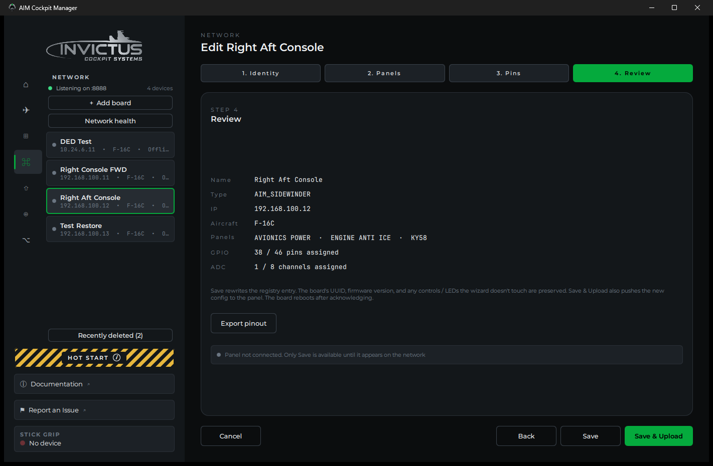
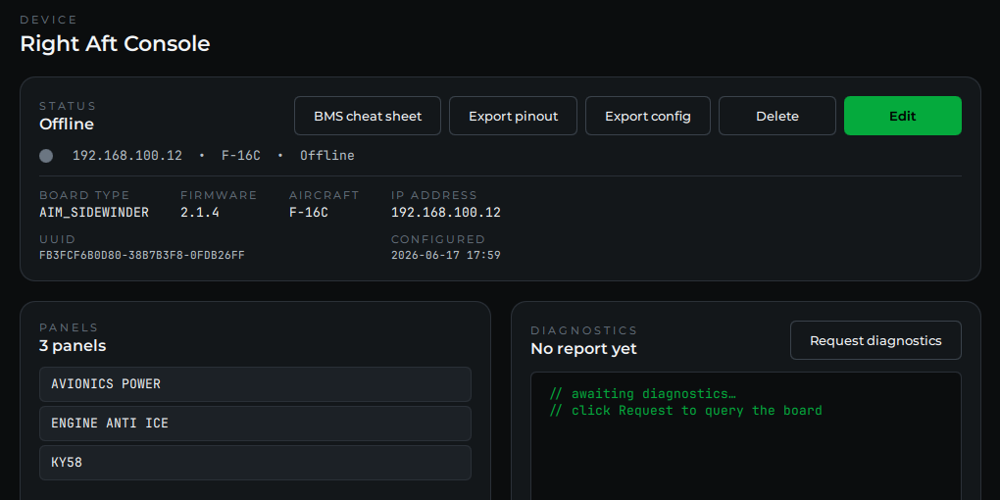

# Add Your First Board

**What you'll do:** power on a board, let the manager discover it, and run through the setup wizard to name the board and assign your cockpit panels to it.

This page walks through an AIM board on the cockpit network. An Open Hardware board over USB uses the same wizard minus the network step; see [Open Hardware](open-hardware.md) for how it is detected and installed.

## Before you begin

- The airframe is selected on the **Home** page. The wizard offers the panels of that airframe.
- The cockpit network is configured and the manager shows **Listening** on the Network page. See [Set Up the Cockpit Network](set-up-the-cockpit-network.md).
- The board is physically connected to your PoE switch and powered on.

## Steps

### 1. Watch for the board to appear

Within a few seconds of the board powering on, a **New board detected** prompt appears, and the board shows in the list on the **Network** page with a **NEW** badge.

> [!NOTE]
> If the board has been powered on before but never fully configured, it shows an **UNCONFIG** badge instead of NEW. Both lead to the same setup wizard.

### 2. Open the wizard

Click **Configure now** in the prompt. If you dismissed it with **Later**, click the board in the Network list and then **Configure**. The board setup wizard opens.

### 3. Name the board

Give the board a name that tells you where it lives in the cockpit, for example, **Left Console**, **Right Console Aft**, or **Instrument Panel**. This name shows up in the board list and in every panel assigned to this board, so be specific if you have more than one board.

The **Identity** step also shows the board type the manager detected and the IP address it will assign; **Suggest** picks the next free address on the cockpit network. **Import config from file…** fills everything in from a saved config instead; see [Swap or Replace a Board](swap-or-replace-a-board.md).

### 4. Pick the cockpit panels on this board

Select which panels will be physically wired to this board. The list shows how many pins and controls each panel takes, and keeps a running count of input pins against what the board has. Check each panel that has switches or knobs connected to this board's pins.

A panel already set up on another board says so: **already on** that board's name. You can still pick it, but Console Panels reads a panel from one board only, so move it rather than duplicate it.

> [!TIP]
> You can assign more panels later if you're not sure yet. **Edit** on the board's page reopens the wizard, so you don't need to start from scratch.

### 5. Assign an SPI or I²C channel (if applicable)

If any of the panels you selected have a physical display (UHF, CMDS, DED) or the caution panel, a dropdown appears on that panel's row for which channel on this board it is wired to. Pick **SPI Channel 1** or **SPI Channel 2**, or an I²C channel for I²C panels, to match your wiring. If you're not wiring displays yet, skip this. You can set it later.

### 6. Assign pins to your controls

The wizard's **Pins** step lists every switch, knob, and lamp on the panels you picked. Assign each one to a pin on the board from its dropdown. Click **Auto-assign** to fill them in sequentially as a starting point, or set them by hand. Switches and indicators use one GPIO pin, three-position switches and encoders use two, a rotary switch uses one pin per position or a single potentiometer channel through a resistor ladder, and pots use a potentiometer channel (P1 to P8 on a Sidewinder).

This is also where you plan your wiring: reviewing the auto-assignment, catching pin conflicts, and exporting a printable pin list to wire from. See [Assign Controls to Pins](assign-controls-to-pins.md). If you would rather wire first and let the manager work out the pins, learn mode is on the same page.

### 7. Save & Upload

The **Review** step sums up the setup. Click **Save & Upload**. The manager pushes the configuration to the board and assigns it its static IP on the cockpit network. The board reboots briefly and reappears in the list with a green dot and your chosen name. **Save** alone keeps the setup in the manager without sending it, for a board that is not connected right now.

## Check it worked

Click the board in the Network list. Its page shows:

- **Online** with a green dot
- Your chosen name and the board type (**AIM Sidewinder** or **AIM Phoenix**)
- The panels you picked
- No badge on its row (no NEW or UNCONFIG)

**Edit** on that page reopens the wizard whenever you need to change something.

## If something's wrong

| Problem | Fix |
|---|---|
| Board disappears after saving | Wait 10-15 seconds. The board reboots to apply its new config. If it doesn't reappear, check the PoE switch link light and try power-cycling the board. |
| Board reappears with UNCONFIG | The config didn't save. Check the network connection and try the wizard again. |
| Panels I need aren't in the list | Check the airframe on the Home page; the list shows that airframe's panels. If a panel is genuinely missing, contact support. |

---

**Next:** [Assign Controls to Pins](assign-controls-to-pins.md)
