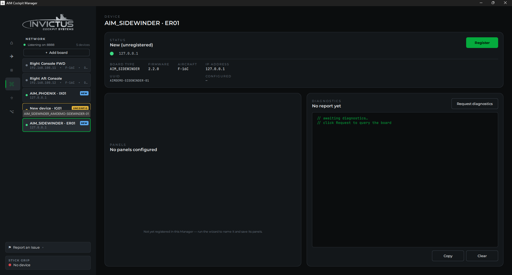
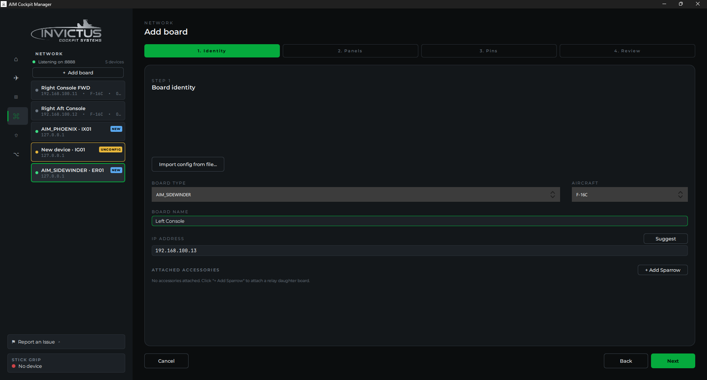
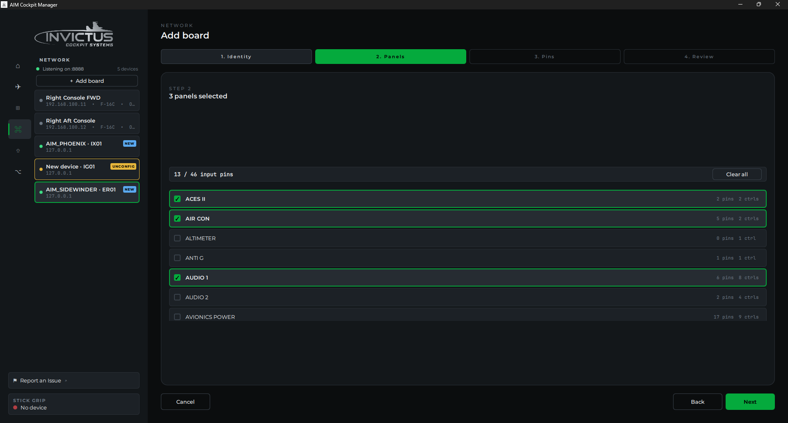
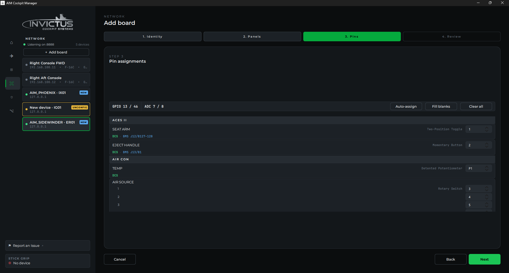
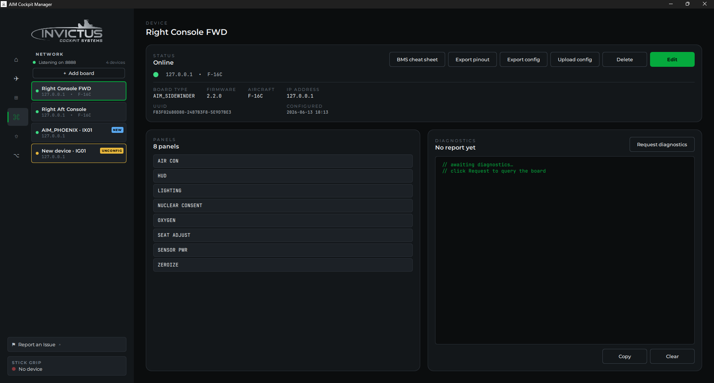

# Add Your First Board

**What you'll do:** power on a board, let the manager discover it, and run through the setup wizard to name the board and assign your cockpit panels to it.

## Before you begin

- The cockpit network is configured and the manager shows **Listening** on the Network page. See [Set Up the Cockpit Network](set-up-the-cockpit-network.md).
- The board is physically connected to your PoE switch and powered on.

## Steps

### 1. Watch for the board to appear

Switch to the **Network** page in the manager. Within a few seconds of the board powering on, it appears in the board list with a **NEW** badge.

> [!NOTE]
> If the board has been powered on before but never fully configured, it may show an **UNCONFIGURED** badge instead of NEW. Both badges open the same setup wizard.

### 2. Open the wizard

Click the board row (or the **Set Up** button that appears next to it). The board setup wizard opens.

### 3. Name the board

Give the board a name that tells you where it lives in the cockpit, for example, **Left Console**, **Right Console Aft**, or **Instrument Panel**. This name shows up in the board list and in every panel assigned to this board, so be specific if you have more than one board.

### 4. Pick the cockpit panels on this board

Select which F-16C panels will be physically wired to this board. The manager groups panels by cockpit location: Left Console, Right Console, Instrument Panel, and so on. Check each panel that has switches or knobs connected to this board's pins.

> [!TIP]
> You can assign more panels later if you're not sure yet. It's easy to add or remove panels from a board after the wizard. You don't need to re-run it from scratch.

### 5. Assign an SPI channel (if applicable)

If any of the panels you selected have a physical display (UHF, CMDS) or a caution panel with indicator lights, the wizard asks which SPI channel on this board those devices are wired to. Pick **SPI Channel 1** or **SPI Channel 2** to match your wiring. If you're not wiring displays yet, skip this. You can set it later.

### 6. Assign pins to your controls

The wizard's **Pins** step lists every switch, knob, and lamp on the panels you picked. Assign each one to a pin on the board. Click **Auto-assign** to fill them in sequentially as a starting point, or set them by hand. Switches and indicators use one GPIO pin (three-position switches and encoders use two); pots use a potentiometer channel (P1-P8).

This is also where you plan your wiring. For the full workflow. Reviewing the auto-assignment, catching pin conflicts, and exporting a printable pin list to wire from; see [Assign Controls to Pins](assign-controls-to-pins.md).

### 7. Save

Click **Save**. The manager pushes the configuration to the board and assigns it a static IP on the cockpit network. The board reboots briefly and reappears in the list with a green dot and your chosen name.

## Check it worked

The board row should show:
- A **green dot** (connected and running)
- Your chosen name
- The board type (**Sidewinder** or **Phoenix**)
- No badge (no NEW or UNCONFIGURED)

## If something's wrong

| Problem | Fix |
|---|---|
| Board disappears after saving | Wait 10-15 seconds. The board reboots to apply its new config. If it doesn't reappear, check the PoE switch link light and try power-cycling the board. |
| Board reappears with UNCONFIGURED | The config didn't save. Check the network connection and try the wizard again. |
| Panels I need aren't in the list | Make sure you've selected the correct cockpit zone tab. If a panel is genuinely missing, contact support. |

---

**Next:** [Assign Controls to Pins](assign-controls-to-pins.md)
