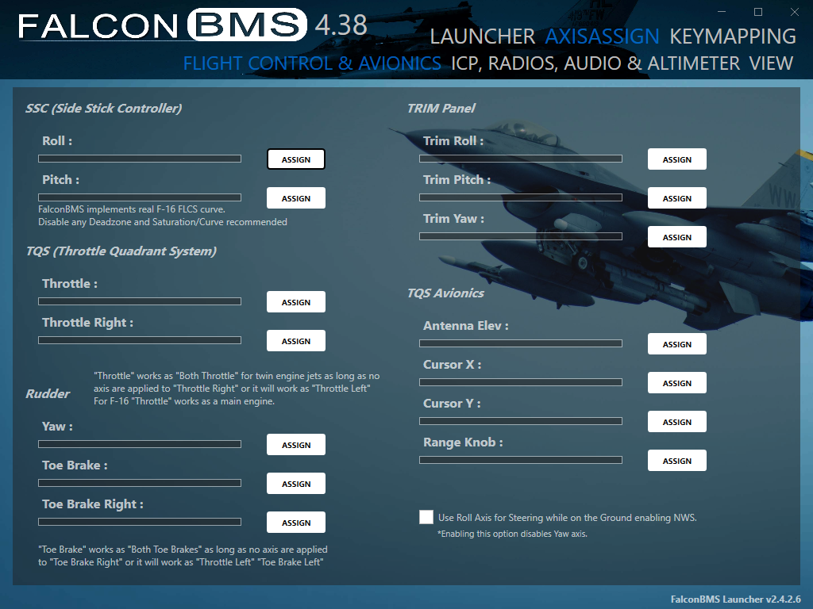

# Assign Axes in BMS

Volume knobs, trim wheels, and other continuously-variable controls appear as **axes** on the AIM Ghost Joystick devices. Unlike buttons, BMS doesn't automatically bind axes from the keyfile. You assign each one once in BMS's controller setup.

Axes are assigned in the **BMS launcher's AXIS ASSIGN tab**, not in the keyfile.

## Before you begin

- The AIM Ghost Joystick driver is installed and your devices are created. See [Install the Virtual-Joystick Driver](install-the-virtual-joystick-driver.md).
- You have the **control map export** open for reference. It lists every analog control, which AIM Ghost Joystick device it's on, and which axis number it uses. To generate it, open **Setup BMS keyfile** in the manager and click **Export control map**.

## Steps

1. Open the **BMS launcher** and click the **AXIS ASSIGN** tab.
2. Pick the sub-tab for the axis you're assigning: **Flight Controls & Avionics** for stick/throttle/rudder/trim, or **ICP, Radios, Audio & Altimeter** for the AIM volume and brightness axes.
3. Find the BMS function you want (e.g., an audio volume), then move the matching physical control on your cockpit panel. The launcher detects the AIM Ghost Joystick axis and fills it in. (Use the control map export to know which device/axis each control is on.)
4. Repeat for each analog control.

Once assigned, the launcher saves your axis bindings. You only need to redo this if your setup files are reset.

> [!NOTE]
> The control map export includes an "Axis" column for every analog control. Print it and keep it at your bench. It saves time matching each physical control to the right AIM Ghost Joystick axis.

---

**See also:** [Load the Keyfile](load-the-keyfile.md), [Set Up Falcon BMS](set-up-falcon-bms.md)
