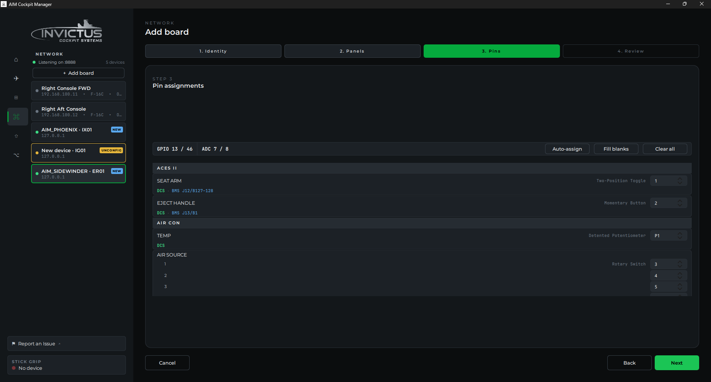

# Assign Controls to Pins

**What you'll do:** plan your pin layout in the manager, export it as a reference sheet, and use that sheet to guide the physical wiring of your board.

After the board wizard, the manager knows which panels are on the board, but it doesn't yet know *which pin* each control is connected to. The recommended approach is to **assign pins first, then wire**. The manager can export your complete pin layout so you have a wiring guide in hand before you touch a soldering iron.

## Before you begin

- Your board is configured and showing a green dot on the Network page. See [Add Your First Board](add-your-first-board.md).
- Your controls don't need to be wired yet. Assigning pins before wiring is the recommended workflow.

## How pin assignment works

Open a configured board from the Network page. Select a panel from the list on the left. You'll see every control in that panel listed. Each switch, knob, or pot has a **pin** field next to it.

- **Switches and momentary buttons** use a single **GPIO pin**. The board monitors that pin for a connection to ground (closed = pressed/on). **Three-position switches** use **two GPIO pins**, one for each end position.
- **Rotary encoders** use **two GPIO pins**, one for each direction of rotation. Assign them in order: pin A first, then pin B.
- **Pots and Hall-effect sensors** use a **potentiometer channel** (P1-P8). Sidewinder boards have 8 potentiometer channels. The Phoenix has none and cannot accept potentiometers or Hall-effect sensors directly.

## Steps

### 1. Open the panel

From the Network page, click your configured board to expand it, then click the panel you want to assign.

### 2. Assign pins to controls

For each control, click the pin field and type the pin number, or use the up/down arrows to select one. The label tells you what type of input it expects: **GPIO** for switches and encoders, **ADC** for pots.

> [!TIP]
> The **Auto-assign** button at the top of the panel fills in pin numbers sequentially starting from the first available pin on the board (**Fill blanks** assigns only the unassigned controls; **Clear all** resets them). It's a useful starting point, but take a few minutes to review the result before you commit to it. Think about how the pins group physically on the board header and how that maps to your controls. Assigning nearby pins to controls that are close together in the cockpit keeps your harness short and organized. A little planning here pays off every time you need to trace a wire later. A cockpit wired without any thought to grouping can turn into a nightmare very quickly.

### 3. Check for conflicts

If two controls share the same pin, the manager highlights them in red. Each control must have its own unique pin. Potentiometer channels and GPIO pins are numbered separately: GPIO pin 1 and potentiometer channel P1 are different physical pins.

### 4. Save

Click **Save** on the panel. The manager pushes the updated pin map to the board immediately. No reboot needed.

### 5. Export the pin list

Once a panel is saved, click **Export pinout**. The manager generates a document listing every control alongside its assigned pin number and input type. Ready to use as a wiring guide.

> [!TIP]
> **Print it or save it somewhere permanent.** A complete pin list for every panel in your cockpit is one of the most valuable reference documents you can keep. Six months after the wiring is done and the cockpit is buttoned up, you will not remember which pin that one FLCS switch is on, but if you have the exported sheet, you'll find it in seconds. Keep a folder (physical or digital) with a pin list for every board in your cockpit. It will save you enormous headaches when you need to troubleshoot, add a panel, or re-wire anything.

### 6. Repeat for each panel

Work through each panel assigned to this board. Export a pin list for each one before moving on. You don't have to assign everything at once; unassigned controls just sit inactive until you do.

## Wire your controls

With your pin lists in hand, wire each control to its assigned pin: switches and indicators use one GPIO pin (the other leg to **GND**. No pull-up resistor needed), rotary encoders use two GPIO pins plus GND, and pots use a potentiometer channel with **3.3V** and GND on the outer legs and the wiper to the channel. **Never feed 5V into a pot channel. It will damage the board.** All board headers use JST PH connectors. See the [FAQ](faq.md) for common wiring questions.

## Check it worked

After wiring, switch to the **Live** view for the panel. Flip a switch or turn a knob on the physical board. The corresponding control in the manager should react in real time. If it does, the assignment is correct.

If a control doesn't respond, the two most common causes are a wrong pin number or a wiring issue; see [Test and Calibrate](test-and-calibrate.md) for how to tell which it is.

## Pin numbering reference

| Board | GPIO pins | Pot channels |
|---|---|---|
| Sidewinder | 1-46 | P1-P8 |
| Phoenix | 1-16 | None |

---

**Next:** [Test and Calibrate](test-and-calibrate.md)
