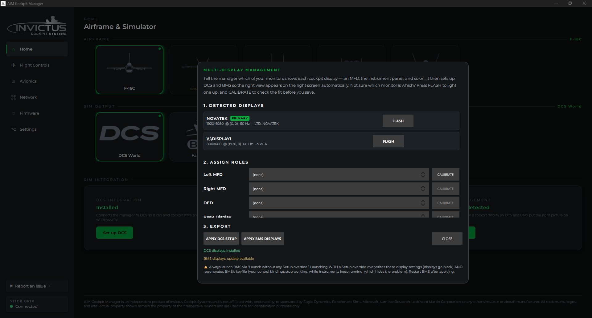

# Cockpit Displays in BMS

**What you'll do:** configure BMS to send your MFD, DED, RWR, EHSI, and HUD views to secondary monitors on the same PC using RTTClient.

## Before you begin

- BMS is installed. RTTClient (`RTTClient64.exe`) is included with BMS at `[BMS install]\Tools\RTTRemote\`. If that file doesn't exist, check your BMS installation.
- You have already assigned your monitors in the **Multi-Display Management** dialog. The role assignments (Left MFD, Right MFD, DED, etc.) are shared with DCS. You set them once and use them for both sims. See [Cockpit Displays in DCS](cockpit-displays-in-dcs.md) for how to set this up.

## How BMS display output works

BMS can export its cockpit displays as real-time textures (RTT). Two separate tools use those textures in different ways:

**RTTClient** (`RTTClient64.exe`) runs on the **same PC as BMS** and renders the exported cockpit textures into windows on your secondary monitors. This is what the manager sets up.

**RTT Server** is a separate feature for streaming cockpit displays **over a local network to a different computer**. The manager does not configure RTT Server. If you use it, your network-export settings are left untouched. (Both tools live in the `Tools\RTTRemote\` folder.)

For RTTClient to work, three things must be in place:

1. BMS must export its cockpit display textures. Controlled by `g_bExportRTTTextures 1` in `Falcon BMS User.cfg`.
2. `RTTClient.ini` must have entries for each display you want to show, with the correct pixel coordinates.
3. RTTClient (`RTTClient64.exe`) must be running.

The manager handles all three automatically when you click **APPLY BMS DISPLAYS**.

## Steps

### 1. Open the display setup

On the manager home page, find the **DISPLAY MANAGEMENT** card and click **Setup displays**.

In the **3. EXPORT** section at the bottom of the dialog, you'll see the **APPLY BMS DISPLAYS** button and a BMS status line.

### 2. Check the status

The status line shows:

- **BMS display helper not found**: `RTTClient64.exe` isn't at the expected path. Check your BMS installation.
- **BMS displays: not applied yet**: RTTClient is found but not yet configured.
- **BMS displays: update available**: configured but your role assignments have changed since the last apply.
- **BMS displays: installed**: configured and current.

The **APPLY BMS DISPLAYS** button is only enabled when RTTClient is found.

### 3. Apply BMS displays

Click **APPLY BMS DISPLAYS**. The manager:

- Writes the display position entries into `[BMS install]\Tools\RTTRemote\RTTClient.ini` for each assigned role. Any RTT Server (network export) settings you've configured are left untouched.
- Enables RTT texture export by writing `g_bExportRTTTextures 1` to `Falcon BMS User.cfg`.

> [!NOTE]
> The export flag goes in `Falcon BMS User.cfg`, not the base `Falcon BMS.cfg`. The User.cfg takes precedence and is honored even when launching BMS without applying overrides.

The status line updates to **BMS displays: installed**.

> [!IMPORTANT]
> **Always launch BMS with "Launch without applying overrides" ticked.**
>
> Launching with overrides applied causes BMS to rewrite its cfg, which overwrites the texture export settings the manager just applied. Your displays go black and your keyfile gets clobbered at the same time. "Launch without applying overrides" is the only safe launch mode for cockpit builders.

### 4. Start RTTClient

RTTClient (`RTTClient64.exe`) must be running for the displays to appear on your secondary monitors. You can start it manually or have the manager launch it automatically.

**Manual:** Navigate to `[BMS install]\Tools\RTTRemote\` and run `RTTClient64.exe`. It appears in your system tray.

**Automatic:** In the manager, go to **Settings** and enable **Auto-launch BMS display tool**. The manager detects when BMS starts running and launches RTTClient automatically.

### 5. Launch BMS and fly

Start BMS with **"Launch without applying overrides"** ticked. Load into a mission. Your secondary monitors should show the assigned cockpit views once you're in the cockpit.

> [!NOTE]
> RTTClient only receives textures while BMS is actively rendering a cockpit. The display windows appear when RTTClient starts, but they show the cockpit view only once you're loaded into a mission.

## Check it worked

Each assigned monitor should display its cockpit view: Left MFD, Right MFD, DED, and so on. RTTClient will be visible in the system tray.

The dialog's BMS status line reads **BMS displays: installed**.

## If something's wrong

| Problem | Fix |
|---|---|
| APPLY BMS DISPLAYS button is grayed out | RTTClient not found. Check that `[BMS]\Tools\RTTRemote\RTTClient64.exe` exists. |
| Displays are black after launching BMS | BMS was likely launched with overrides applied, resetting User.cfg. Re-apply in the manager, then relaunch BMS with "Launch without applying overrides" ticked. |
| RTTClient is in the tray but displays show nothing | Make sure you're loaded into a mission: BMS only exports cockpit textures once an aircraft is active. |
| Display is assigned but doesn't appear on that monitor | Check that RTTClient is running (system tray). If it's not there, start it manually or enable auto-launch in Settings. |
| Status shows "BMS displays: update available" | Monitor assignments changed since you last applied. Click APPLY BMS DISPLAYS again and relaunch BMS. |

---

**See also:** [Cockpit Displays in DCS](cockpit-displays-in-dcs.md), [Set Up Falcon BMS](set-up-falcon-bms.md), [Load the Keyfile](load-the-keyfile.md)
