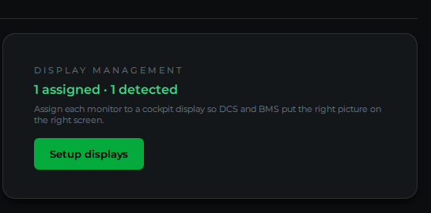
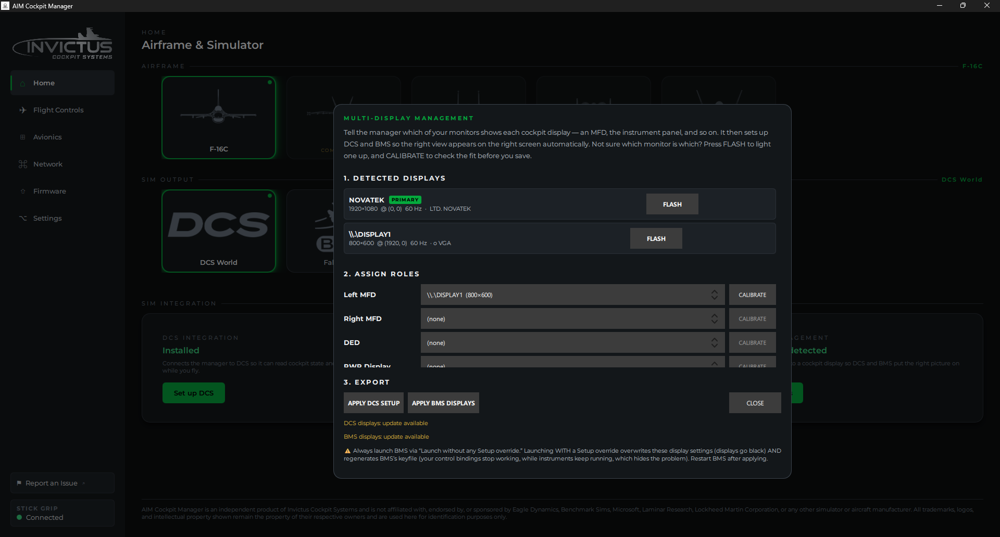
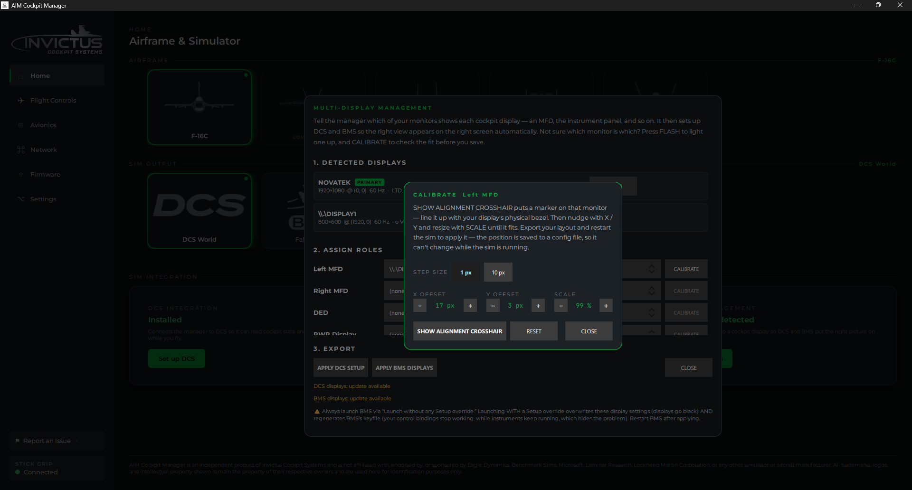
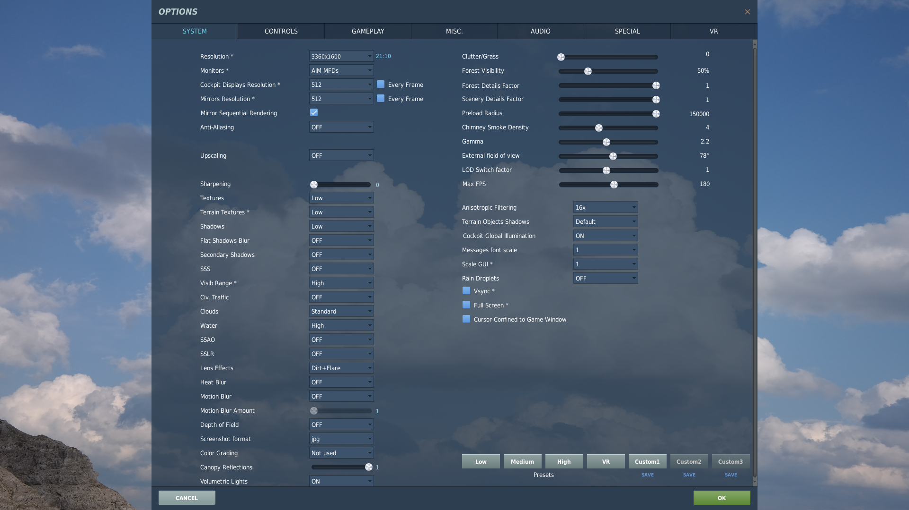

# Cockpit Displays in DCS

**What you'll do:** assign each of your secondary monitors to a cockpit display role, MFD, DED, RWR, EHSI, or HUD, so DCS draws the right view on the right screen automatically.

## Before you begin

- The DCS integration is installed. See [Set Up DCS](set-up-dcs.md).
- Your secondary monitors (MFD screens, DED panel, etc.) are connected and Windows recognizes them.
- DCS World is **not running** while you configure the layout: DCS reads its monitor setup on launch, so changes only take effect after a restart.

## How it works

DCS uses a monitor layout file (`MonitorSetup.lua`) to know which desktop coordinates to use for each cockpit view. The manager generates this file from your assignments and saves it directly into your DCS Saved Games folder. After applying, you pick the layout in DCS Options and restart. No manual file editing required.

Each display role is rendered into a **centered square** within its assigned monitor. Because the F-16C's MFD is a 1:1 aspect ratio, this means a widescreen or 4:3 monitor will have black bars on the sides. That's correct and expected behavior.

## Steps

### 1. Open the display setup

On the manager home page, find the **DISPLAY MANAGEMENT** card and click **Setup displays**.

The **Multi-Display Management** dialog opens.

### 2. Identify your monitors

The top section, **1. DETECTED DISPLAYS**, lists every monitor Windows knows about, showing the name, resolution, position, and refresh rate.

If you're not sure which physical monitor corresponds to which entry in the list, click **FLASH** next to it. A full-screen green window appears on that monitor so you can identify it at a glance. Close it by clicking anywhere on it or pressing Escape.

### 3. Assign roles to monitors

In the **2. ASSIGN ROLES** section, each cockpit display role has a dropdown. For each role you want to use, pick the monitor it should appear on:

| Role | What it shows |
|---|---|
| **Left MFD** | Left multi-function display |
| **Right MFD** | Right multi-function display |
| **DED** | Data Entry Display |
| **RWR Display** | Radar Warning Receiver |
| **EHSI** | Horizontal Situation Indicator |
| **HUD Repeat** | HUD repeater view |

You only need to assign the roles you're actually wiring up. Unassigned roles are skipped.

### 4. Fine-tune the position (optional)

Once a monitor is assigned to a role, the **CALIBRATE** button for that role becomes active. Click it to open the calibration popup, where you can nudge the viewport left, right, up, or down (X/Y offset, in pixels) and adjust the scale percentage. The **STEP SIZE** toggle switches between 1 px and 10 px nudges. Click **SHOW ALIGNMENT CROSSHAIR** to place a crosshair marker on the assigned monitor so you can line the viewport up with the display's physical bezel.

> [!TIP]
> In some instances the exported window from DCS may be smaller than you expected, leading to your desktop image appearing on the edges.  If that creates a problem, set your wallpayer to a plain black background.

### 5. Apply the DCS setup

Click **APPLY DCS SETUP**. The manager writes a `MonitorSetup.lua` file to your DCS Saved Games folder and, if you assigned the RWR display, applies an aircraft patch file that enables the RWR viewport in DCS.

A confirmation dialog appears telling you exactly what to do next in DCS.

### 6. Configure DCS Options

Open DCS World and go to **Options → System**.

1. Set **Resolution** to the value the manager recommended (DCS auto-adds this entry to its dropdown after reading the new layout file).
2. Set **Monitors** to **AIM MFDs**.
3. Click **Apply** and restart DCS.

> [!IMPORTANT]
> You must do this step every time you change which monitors are assigned: DCS won't pick up a new layout file until you select it in Options and restart.

## Check it worked

Load into the F-16C in DCS. Each assigned monitor should show its cockpit display. The view fills a centered square on the screen. Black bars on the sides of the monitor are normal and expected.

The **DISPLAY MANAGEMENT** card on the home page shows how many roles are assigned and how many monitors were detected. After applying, the dialog's status line reads **DCS displays: installed**.

## If something's wrong

| Problem | Fix |
|---|---|
| Monitors don't appear after clicking Apply DCS Setup | Make sure you completed step 6. Selected "AIM MFDs" in DCS Options → System and restarted DCS. |
| A display is on the wrong monitor | Reopen the dialog, change the dropdown for that role, click Apply DCS Setup again, then restart DCS. |
| Display appears in the wrong spot on the screen | Open the Calibrate popup for that role and nudge the dx/dy values. |
| "DCS displays: update available" badge appears on the card | Click Setup displays and click Apply DCS Setup again. Your layout changed since the last time you applied. |
| RWR display doesn't show up in DCS | The RWR needs an aircraft file patch, applied automatically when you click Apply DCS Setup. Look for the confirmation note in the dialog. If it reports **no F-16C module was found**, your DCS is probably on a different drive: open the **DCS Integration** card, click **Set folder…**, and pick your main DCS folder (the one with `Mods` and `bin`). If the patch can't be written, restart the **manager** (not DCS) as Administrator: DCS installs under Program Files, which is write-protected. |
| FLASH button doesn't help. No monitor lights up | The monitor may be turned off or Windows may not see it. Check your display connections and try Windows Settings → Display to verify it's detected. |

---

**Next:** [Set Up Falcon BMS](set-up-falcon-bms.md)

**See also:** [Cockpit Displays in BMS](cockpit-displays-in-bms.md), [Set Up DCS](set-up-dcs.md)
