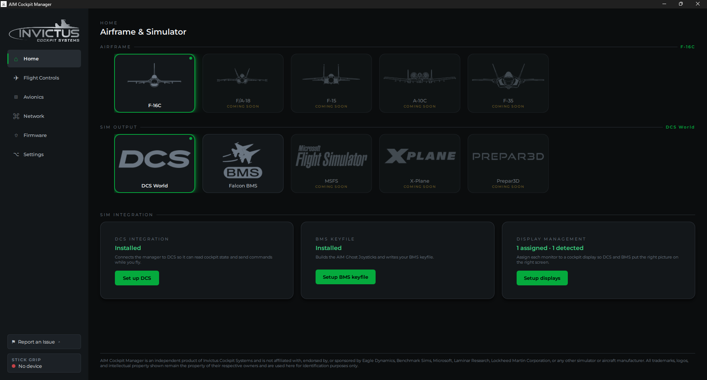

# AIM Cockpit Manager: User Guide

Welcome. This guide covers everything you need to get your Invictus cockpit wired up, configured, and flying.

## What the AIM platform is

The **AIM network** is the backbone of your Invictus cockpit. Each panel board (Sidewinder, Phoenix) connects to your PC over a single Ethernet cable that carries both data and power. No separate power supplies, no USB hubs, no driver installs for the boards themselves. The **AIM Cockpit Manager** is the Windows app that ties it all together: it finds your boards, walks you through setup, and keeps your switches, knobs, and displays in sync with the sim while you fly.

## What the manager does

- Finds every board on your cockpit network automatically and guides you through a first-time wizard.
- Lets you assign each switch, knob, and pot to a pin, then test it live. No round-trips to the simulator.
- Installs the sim integration for DCS World and Falcon BMS.
- Puts your MFDs, DED, RWR, HUD, and EHSI on extra monitors in both sims.
- Updates itself and your board firmware over the air. No USB cables after the first flash.

## Where to start

**Setting up for the first time?** Work through these in order:

1. [What You Need](what-you-need.md). Hardware and software checklist before you begin
2. [Install the Manager](install-the-manager.md). Download, install, first launch
3. [Set Up the Cockpit Network](set-up-the-cockpit-network.md). Get your PC talking to the boards
4. [Add Your First Board](add-your-first-board.md). The setup wizard
5. [Assign Controls to Pins](assign-controls-to-pins.md). Map your switches and knobs

**Already running, looking for something specific?**

| I want to… | Go to |
|---|---|
| Set up DCS World | [Set Up DCS](set-up-dcs.md) |
| Set up Falcon BMS | [Set Up Falcon BMS](set-up-falcon-bms.md) |
| Put displays on extra monitors | [Cockpit Displays in DCS](cockpit-displays-in-dcs.md) or [Cockpit Displays in BMS](cockpit-displays-in-bms.md) |
| Set up my VFT5 stick | [VFT5 Side-Stick](vft5-side-stick.md) |
| Wire indicator lights or segment displays | [Indicator and Caution Lights](indicator-and-caution-lights.md) |
| Fix something that's not working | [Troubleshooting](troubleshooting.md) |
| Update the manager or board firmware | [Update the Manager](update-the-manager.md) |

## A note on sims

DCS World is the primary and most complete integration. Falcon BMS (F-16C and eventiually F-15) is fully supported as of v1.1.0. When a control isn't simulated in a particular sim, the tooltip in the manager tells you.
