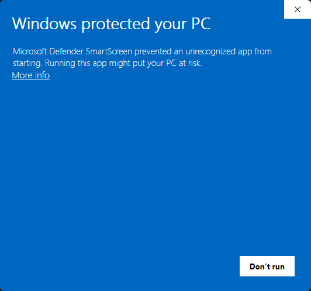
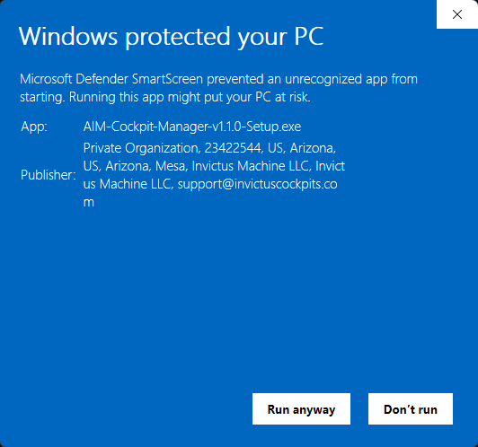
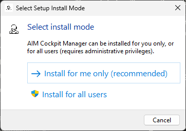
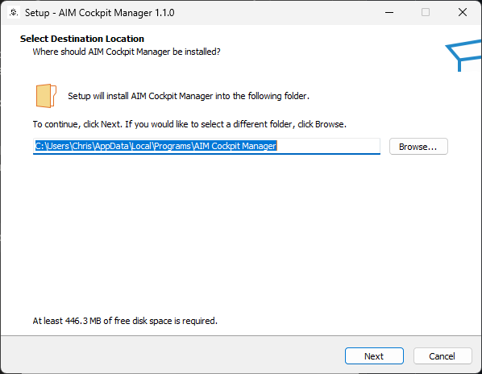
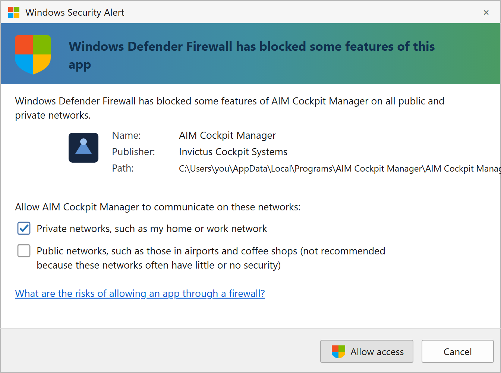

# Install the Manager

**What you'll do:** download the installer, run it, and get the manager open for the first time.

## Before you begin

- Windows 10 (21H2+) or Windows 11. See [What You Need](what-you-need.md) for the full checklist.

## Steps

### 1. Download the installer

Go to the [Software page at invictuscockpits.com](https://invictuscockpits.com/pages/software) and download the latest `AIM-Cockpit-Manager-vX.X.X-Setup.exe`.

### 2. Get past the SmartScreen warning

Double-click the downloaded file. Because AIM Cockpit Manager is a newly released app, Windows SmartScreen may show a blue **"Windows protected your PC"** screen. This is normal for new software and **does not** mean anything is wrong.

Click **More info**. The **Publisher** line should read **Invictus Machine LLC**, the legal entity behind Invictus Cockpit Systems (the installer is code-signed). Confirm that, then click **Run anyway**.

> [!TIP]
> If the **Publisher** is blank or anything other than **Invictus Machine LLC**, stop. Don't run it. Re-download from the [Software page](https://invictuscockpits.com/pages/software). You can also verify the file directly: right-click it → **Properties** → **Digital Signatures**.

### 3. Choose how to install

The installer asks how to install. Choose **Install for me only (recommended)**. This installs just for your account and needs no administrator rights, so you won't see a User Account Control prompt. (Install for all users requires admin and isn't needed.)

### 4. Complete the installer

Click through the wizard. The default options are fine. It installs to your user profile (`%LocalAppData%\Programs\AIM Cockpit Manager`, no admin needed) and adds a Start Menu entry and an optional desktop shortcut.

### 5. Launch the manager

Open **AIM Cockpit Manager** from the Start Menu or desktop shortcut.

On the very first launch, Windows Defender Firewall may ask whether to allow the app on your network. Click **Allow access** and make sure the **Private networks** box is checked. The manager needs to listen for boards on your cockpit network; if you dismiss or block this prompt, boards won't appear; see [Troubleshooting](troubleshooting.md) if that happens.

### 6. Check for updates

The manager checks for a newer version each time it launches. If an update is available, a banner appears across the top of the window. You can install updates from there. No need to re-download the installer from the releases page.

## Check it worked

The manager opens to the **Home** page, where you pick your airframe and simulator. The **Network** page in the sidebar shows **Listening** and, for now, no boards. That's expected; you haven't set up the cockpit network yet. Open Hardware boards over USB appear on the **DIY Devices** page instead.

## If something's wrong

| Problem | Fix |
|---|---|
| Windows SmartScreen says the app is unrecognized | Re-download from the [Software page](https://invictuscockpits.com/pages/software), then check **Properties → Digital Signatures** shows **Invictus Machine LLC**. If it does, click **More info → Run anyway**. |
| Installer won't run / Windows blocks it | Right-click the installer → **Properties** → **Unblock** → try again. |
| Manager won't open after install | Check Start Menu for "AIM Cockpit Manager." If it's not there, re-run the installer. |
| AIM boards not appearing after launch | Continue to [Set Up the Cockpit Network](set-up-the-cockpit-network.md). Discovery needs the network configured first. |
| A USB board not appearing after launch | See [Open Hardware](open-hardware.md). The board needs the manager's firmware installed first. |

---

**Next:** [Set Up the Cockpit Network](set-up-the-cockpit-network.md)
