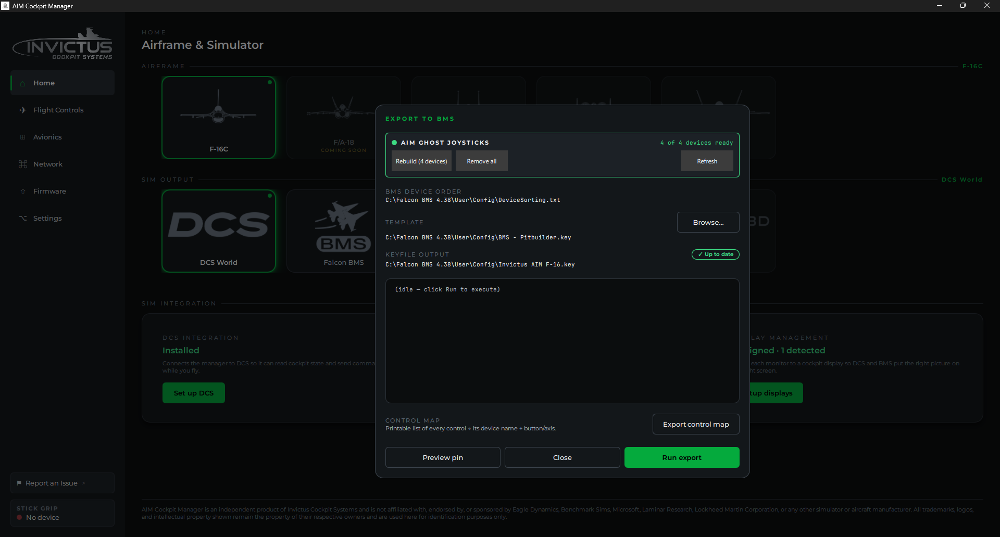
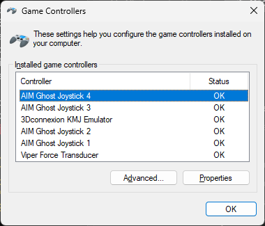

# Install the Virtual-Joystick Driver

**What you'll do:** install the AIM Ghost Joystick driver so Falcon BMS can receive inputs from your cockpit panels.

## Before you begin

- You are setting up BMS. If you're only using DCS, you don't need this driver. Panel boards communicate over the network without it.
- The manager is running. See [Install the Manager](install-the-manager.md).

## What this driver does

BMS reads game controllers using standard HID (joystick) input. Your cockpit panels are network devices, not USB controllers, so the manager installs an **AIM Ghost Joystick** virtual driver that creates up to five virtual joystick devices on your PC. The manager bridges network input from your boards to these virtual devices, and BMS reads them like any other controller.

The driver is **EV-signed** (Extended Validation code signed by Invictus Machine LLC) and does not require  any Windows security changes.

## Steps

The driver is installed from within the **BMS KEYFILE** dialog. If you haven't opened it yet:

1. On the manager home page, click **Setup BMS keyfile** on the **BMS KEYFILE** card.

The top of the dialog shows the **AIM GHOST JOYSTICKS** status.

### If the status shows "Not installed"

1. Click **Install driver**. Windows will prompt for administrator permission. Click **Yes**.
2. The manager installs the driver and the status updates. This takes a few seconds.
3. Click **Create [N] devices** to create the virtual joystick instances. The number shown matches what the F-16C catalog needs (typically 4).
4. The status changes to **[N] of [N] devices ready**.

### If the status shows devices created but count is wrong

- If you see fewer devices than needed, click **Create [N] devices** to add the missing ones.
- If you see extra devices from a previous installation, click **Remove [N] extra devices** to clean up, then create the correct count.
- Click **Remove all** to tear everything down and start fresh if something looks off.

## Check it worked

The status banner should read **[N] of [N] devices ready** with a green border. Open Windows **Settings → Bluetooth & devices → Controllers** (or `joy.cpl` in Run) and you'll see entries named **AIM Ghost Joystick 1**, **AIM Ghost Joystick 2**, and so on. One per virtual device created.

## If something's wrong

| Problem | Fix |
|---|---|
| Install driver button does nothing | Right-click the manager shortcut and run as administrator, then try again. |
| Status still shows "Not installed" after clicking Install driver | The driver files may not have been included in this release. Contact support. |
| Devices disappear after a reboot | This can happen if Windows Device Manager cleans up virtual devices after an unexpected shutdown. Reopen the dialog and click Create devices again. |
| BMS doesn't see the joysticks after install | Make sure you generated a keyfile and loaded it: BMS won't show them as active until you've done the full setup. See [Load the Keyfile](load-the-keyfile.md). |

---

**Next:** [Load the Keyfile](load-the-keyfile.md)

**See also:** [Set Up Falcon BMS](set-up-falcon-bms.md)
