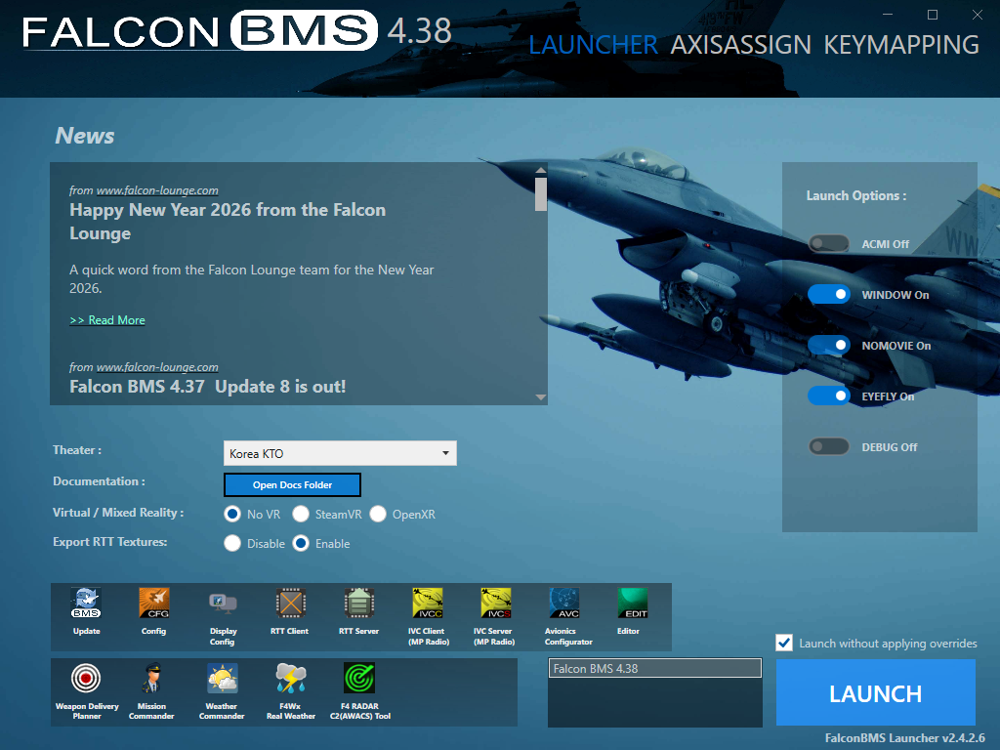
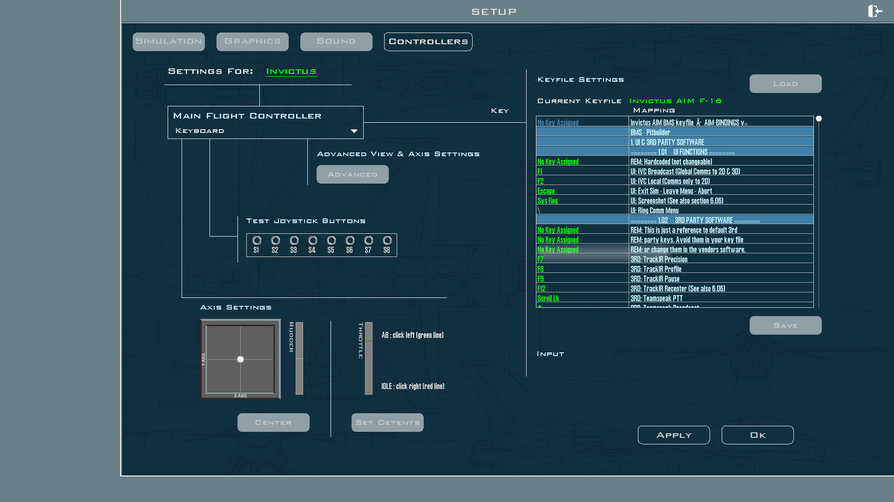

# Load the Keyfile

**What you'll do:** tell Falcon BMS to use the keyfile the manager generated, and configure the launcher so BMS doesn't overwrite it every time you start a session.

## Before you begin

- You have run the keyfile export in the manager. See [Set Up Falcon BMS](set-up-falcon-bms.md).
- The keyfile `Invictus AIM F-16.key` exists in `[BMS install]\User\Config\`.
- The AIM Ghost Joystick driver is installed. See [Install the Virtual-Joystick Driver](install-the-virtual-joystick-driver.md).

---

## Critical: how to launch BMS

> [!IMPORTANT]
> **Always tick "Launch without applying overrides" in the launcher.**
>
> If you launch BMS with overrides applied, the launcher overwrites your custom keyfile and regenerates it from its own defaults. Your cockpit panel bindings stop working. Cockpit lights and instruments (which come from shared memory) will still function, which can make it look like everything is fine when the inputs are actually broken.
>
> In the BMS launcher, tick **Launch without applying overrides** (next to the LAUNCH button) every time. This is the only launch mode that respects the keyfile you loaded.

---

## Load the keyfile in BMS

Loading through the BMS Launcher's Controllers setup can be unreliable. The more dependable method is to load from inside BMS itself after launching:

1. Launch BMS with **"Launch without applying overrides"** ticked.
2. Once BMS is running, go to **Setup → Controllers**.
3. Click **Load** and navigate to `[BMS install]\User\Config\`.
4. Select **Invictus AIM F-16.key** and confirm.

As long as you always launch without applying overrides, BMS remembers this keyfile. You only need to load it once (or again after re-exporting).

> [!TIP]
> After loading, you can verify the bindings in the same Controllers screen. Search for any cockpit panel callback to confirm it's mapped to an AIM Ghost Joystick device and button number.

---

## Assign axes in BMS

After loading the keyfile, volume and analog controls (ICP brightness wheels, audio volume knobs) appear as **axes** on the AIM Ghost Joystick devices. BMS doesn't automatically assign axes. You need to map them once:

1. In BMS, go to **Setup → Controllers**.
2. Find each axis control in the list (the manager's control map export tells you which device and axis number each one is on; see [Set Up Falcon BMS](set-up-falcon-bms.md)).
3. Bind each axis to its BMS function.

Once assigned, axis bindings are saved with your keyfile. You only need to do this once unless your assignment changes.

> [!TIP]
> Use the **Export control map** button in the BMS keyfile dialog to generate a printable HTML reference that lists every cockpit control, its BMS device name, and its button or axis assignment. Open it in a browser, print it, and keep it at your bench while you're setting up BMS.

---

## Keeping the keyfile current

Launching with overrides applied isn't the only way your keyfile can go stale:

- **Manager update**: when the manager ships new control bindings, the **BMS KEYFILE** card on the home page shows **Update available**. Run the export again to pull in the new bindings.
- **Pin changes**: if you reassign a cockpit control to a different button or encoder after the keyfile was generated, re-export to keep BMS in sync.

Both cases are handled the same way. Open **Setup BMS keyfile**, click **Run export**, then reload in BMS.

---

**See also:** [Set Up Falcon BMS](set-up-falcon-bms.md), [Install the Virtual-Joystick Driver](install-the-virtual-joystick-driver.md), [Cockpit Displays in BMS](cockpit-displays-in-bms.md)
