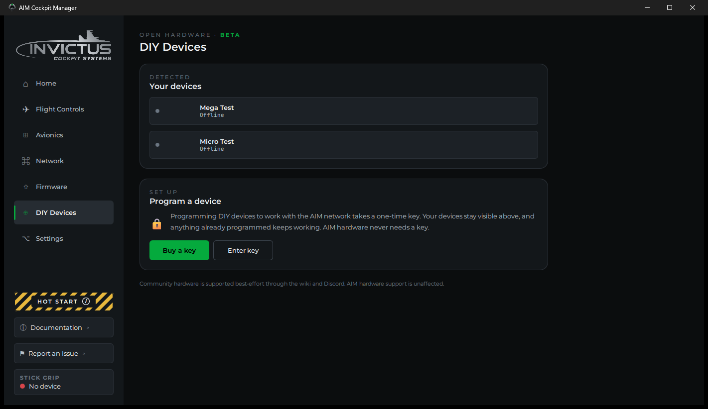
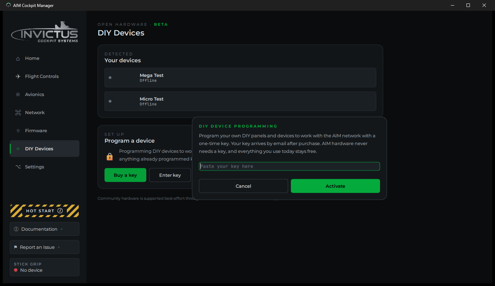
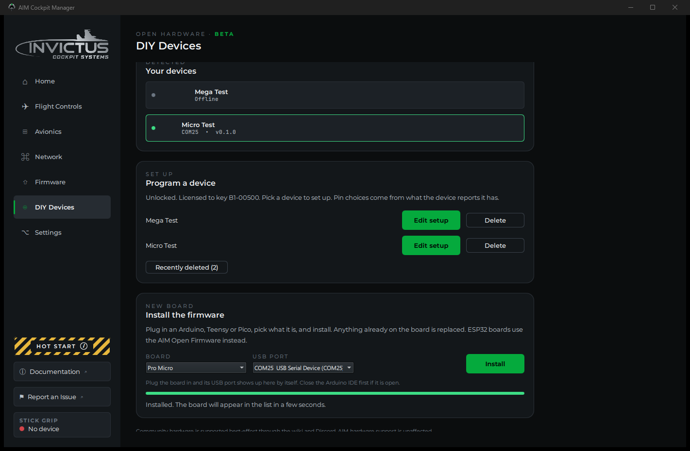

# Open Hardware

**What you'll do:** build a panel on your own Arduino, Teensy or Raspberry Pi Pico, install the manager's firmware on it over USB, and set it up the same way you set up an AIM board.

Open Hardware is for builders who already have a drawer of boards, or who want a small panel without a PoE switch. The boards plug into your PC over USB. Everything the manager does for an AIM board it does for these too: the setup wizard, live testing, learn mode, indicator lights, and the sim integration.

> [!NOTE]
> Open Hardware is in beta. It works, and it is supported best-effort through this guide and Discord. Support for AIM hardware is unaffected.

## What is free and what needs a key

| | Free | Needs an Open Hardware key |
|---|---|---|
| Seeing your boards on the DIY Devices page | Yes | |
| A board you already set up keeps working | Yes | |
| Installing the firmware on a board | | Yes |
| Setting up a board, editing its setup, learn mode | | Yes |

AIM hardware never needs a key. Buy one at [invictuscockpits.com](https://invictuscockpits.com/products/aim-cockpit-manager-open-hardware-license). It arrives by email. A key is licensed to you personally, it is not sold, and it cannot be transferred, as set out in the license agreement shown when you install the manager.

## Boards that work

| Board | Pick this in the install card |
|---|---|
| Raspberry Pi Pico | Raspberry Pi Pico |
| Arduino Nano | Arduino Nano |
| Arduino Uno, Pro Mini | Arduino Uno or Pro Mini |
| Arduino Mega 2560 | Arduino Mega 2560 |
| Pro Micro | Pro Micro |
| Arduino Leonardo | Arduino Leonardo |
| Arduino Micro | Arduino Micro |
| Teensy 4.0, 4.1, 3.1, 3.2, LC | The matching Teensy entry |

Clones work. Go by the chip on the board, not the name on the box: an Elegoo board with an ATmega2560 on it is a Mega 2560 as far as the manager is concerned, and one with an ATmega328P is an Uno.

ESP32 boards run the AIM Open Firmware instead of the install card. That firmware is documented separately.

> [!TIP]
> Use a USB cable that carries data. Many cables that come with phone chargers carry power only, and the board will never show up.

---

## Steps

### 1. Enter your key

Open **DIY Devices** in the sidebar and click **Enter key**. Paste the key from your email and click **Activate**. Spaces or line breaks that a mail program added are ignored.

The key stays on this PC. **Remove key from this PC** in the same dialog takes it off again.

### 2. Install the firmware

Plug the board in. Close the Arduino IDE if it is open, since it holds the port.

In the **Install the firmware** card, pick your board and its USB port, then click **Install**. Anything already on the board is replaced.

Some boards have a step of their own:

| Board | What to expect |
|---|---|
| Nano, Uno | The manager tries the newer bootloader speed first. An older board answers only at the other speed, so the card says "No answer at that speed, trying the other one" and takes about ten seconds longer. |
| Pro Micro, Leonardo, Micro | The card asks the board to restart into install mode. The board drops off USB and comes back on a different port number for a few seconds, and the install follows it there. If the card reports that the board did not answer, press the board's reset button twice quickly and click Install again within eight seconds. |
| Pico | Unplug the Pico, hold its BOOTSEL button, plug it back in, and click Install. The Pico shows up as a small drive and the manager copies the firmware onto it. |
| Teensy | If nothing happens within a few seconds, press the button on the Teensy. |

When the install finishes, the board restarts and shows up as a new device within a few seconds. The manager gives it an identity the first time it connects, so it is recognized from then on.

### 3. Set it up

A **New device detected** prompt appears. Click **Set up**. You can also click **Set up** next to the board on the DIY Devices page at any time.

The wizard is the same one AIM boards use, minus the network step:

1. **Identity.** Give the board a name.
2. **Panels.** Pick the panels this board carries.
3. **Pins.** Assign each switch, lamp and knob to a pin. The wizard offers exactly the pins your board has, using the board's own numbering. See [Pin numbers by board](#pin-numbers-by-board) below. A rotary switch defaults to one analog input through a resistor ladder, which saves a pin per position. See [Resistor Ladder Rotary Switches](resistor-ladder-rotary-switches.md).
4. **Review.** Click **Save & Upload**. The device starts using the setup right away, with no restart.

The manager keeps your setup and sends it to the board every time it connects, so you can edit it later whether or not the board is plugged in.

### 4. Wire it

The board's inputs use built-in pull-ups, so every switch closes to ground.

| Control | Wiring |
|---|---|
| Two-position toggle, pushbutton | One leg to the assigned pin, the other to GND |
| Three-position toggle | Center leg to GND, each end to its assigned pin |
| Rotary switch | One analog input through a resistor ladder (the default, see [Resistor Ladder Rotary Switches](resistor-ladder-rotary-switches.md)), or common to GND and each position to its assigned pin |
| Encoder | Common to GND, A and B to the two assigned pins |
| Potentiometer | Outer legs to the board's 3.3 V (or 5 V on a 5 V board) and GND, wiper to the assigned analog pin |
| Indicator lamp | Assigned pin, through a resistor of about 330 Ω, to an LED, to GND |

A board pin can light an LED. It cannot drive a 12 V lamp, a relay or a motor. Anything bigger than an LED needs a driver between the pin and the load.

### 5. Learn the wiring instead of assigning it

If you would rather wire first and assign afterwards, use learn mode.

1. Open **Avionics**, then **Console Panels**, and click **Learn wiring**.
2. Pick your board and click **Start**.
3. Click a control in the list, then move it on the panel. The manager watches every pin and records the one that moved.
4. Repeat for each control, then click **Done**. The new wiring is sent to the board.

Read each prompt. A two-position toggle is learned on the leg that means ON, so "Flip X to ON" means into the ON position. A three-position toggle is learned one end at a time, starting from the center, because a switch already sitting in the position the prompt asks for has nothing to report.

### 6. Test a lamp

Lamps normally follow the sim. To check a freshly wired one, open **Console Panels**, click the **⋯** button at the right end of the lamp's row, and choose **Test lamp**. Every cell of that indicator lights for three seconds.

---

## Pin numbers by board

The wizard uses each board's own pin numbers, so the number on the board's silkscreen is the number you pick.

| Board | Switches and lamps | Dimmable lamps | Analog inputs |
|---|---|---|---|
| Raspberry Pi Pico | GP1 to GP22 | All of them | GP26, GP27, GP28 |
| Arduino Nano | 2 to 12, A0 to A3 | 3, 5, 6, 9, 10, 11 | A4 to A7 |
| Arduino Uno, Pro Mini | 2 to 12, A0 to A3 | 3, 5, 6, 9, 10, 11 | A4, A5 |
| Arduino Mega 2560 | 2 to 12 and 14 to 53 | 2 to 12, 44, 45, 46 | A0 to A15 |
| Pro Micro | 1 to 10, 14, 15, 16 | 3, 5, 6, 9, 10 | A0 to A3 |
| Leonardo, Micro | 1 to 12 | 3, 5, 6, 9, 10, 11 | A0 to A5 |
| Teensy 4.0 | 1 to 12 | All of them | A0 to A9 |
| Teensy 4.1 | 1 to 12 and the rest of its digital pins | Most of them | A0 to A9, A14 to A17 |
| Teensy 3.1, 3.2 | 1 to 12 | 3, 4, 5, 6, 9, 10 | A0 to A9 |
| Teensy LC | 1 to 12 | 3, 4, 6, 9, 10 | A0 to A9 |

On the Pico, the numbers are the GP numbers printed next to the pins, not the pin count along the board edge. GP1 is the second pin from the corner.

---

## Managing your devices

- **Edit setup** on the DIY Devices page reopens the wizard for that board.
- **Delete** removes the board from the manager and resets it. The board forgets its setup and comes back as a new device.
- **Recently deleted** brings a deleted board back. If it is plugged in, its setup is sent straight back to it.

---

## If something's wrong

| Problem | Fix |
|---|---|
| The board is not in the install card's port list | Use a cable that carries data. Close the Arduino IDE. Try another USB port. |
| "The board did not answer" during install | Check the board and port you picked. For a Pro Micro, Leonardo or Micro, press reset twice quickly and click Install again within eight seconds. |
| The install finished but the board never appears | Unplug it and plug it back in. Give it ten seconds. |
| The wizard offers pins that do not match my board | Plug the board in and open Edit setup again. The pin list comes from the board itself. |
| A switch reads backwards | In Console Panels, click the ⋯ button on the control's row and choose Invert switch wiring. |
| Learn mode recorded the wrong pin on a three-position toggle | Move the switch to the center first, then to the position the prompt asks for, and learn it again. |
| The lamp lights in the manager but not on the board | Check the LED direction and the resistor. The lamp's cell is wired to the pin assigned to that slot. |

---

**See also:** [Add Your First Board](add-your-first-board.md), [Assign Controls to Pins](assign-controls-to-pins.md), [Indicator and Caution Lights](indicator-and-caution-lights.md)
