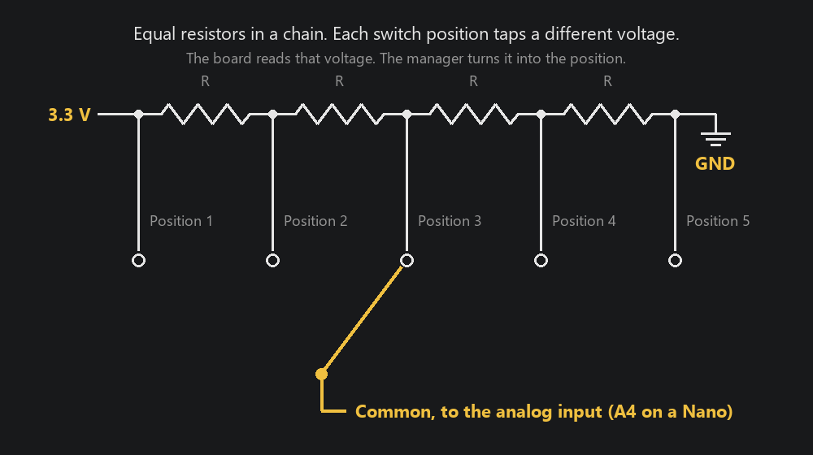
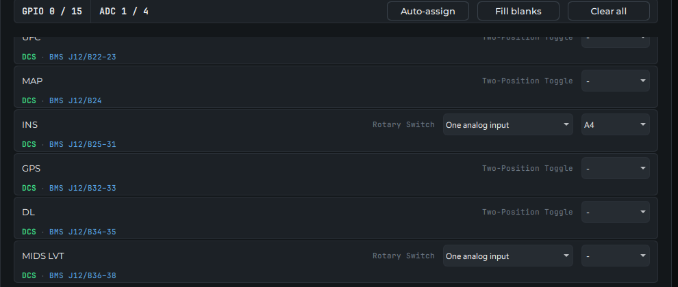
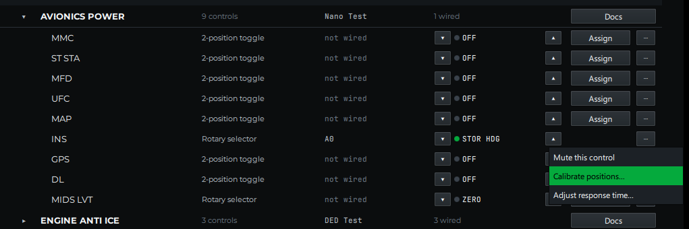
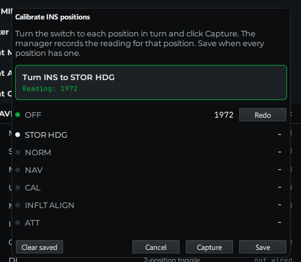

# Resistor Ladder Rotary Switches

**What you'll do:** wire a rotary switch to one analog input instead of one pin per position, then teach the manager what each position reads. Works on an AIM Sidewinder and on Open Hardware boards with analog inputs.

A rotary switch normally costs one pin per position. The F-16's INS knob has seven positions, so on a board with fifteen usable pins it eats half the board on its own. A resistor ladder turns the same switch into a voltage divider: every position puts a different voltage on a single analog input, and the manager works out which position that voltage means.

Nothing changes on the board. The board reports the voltage as a number, the way it reports a pot, and the manager keeps the table of which number belongs to which position.

## How it works

The resistors sit in a chain between the board's supply and ground. Each position of the switch connects the common terminal to a different point along that chain, so the analog input sees a different fraction of the supply at every click. With equal resistors the steps are evenly spaced, which keeps them easy to tell apart.

The board reads the input as a number from 0 to 4095. When you calibrate, the manager records the number at each position. Afterwards every reading is matched to the nearest recorded position. A reading that falls between two positions, which happens for a moment while the knob is turning, is ignored and the last position holds.

## Build one

You need one resistor fewer than the switch has positions. For a seven-position switch that is six resistors.

| Part | What to use |
|---|---|
| Resistors | All the same value, anywhere from 1 kΩ to 10 kΩ. 4.7 kΩ is a good choice |
| Switch | A single-pole rotary switch with the number of positions the panel calls for |
| Supply | The board's own 3.3 V pin. On a 5 V Open Hardware board such as an Arduino Nano, 5 V works too. On an AIM board, always 3.3 V |

Wiring:

1. Solder the resistors in a chain, end to end.
2. Connect one end of the chain to the supply and the other end to GND.
3. Connect the switch's first position to the supply end, its last position to the GND end, and each position in between to the junction between two resistors, in order.
4. Connect the switch's common terminal to the analog input you will assign in the manager.

Where the analog input is:

| Board | Analog input |
|---|---|
| AIM Sidewinder | A potentiometer channel, **P1** to **P8**, on the pot header |
| AIM Phoenix | None. The Phoenix has no analog inputs, so wire its rotaries one pin per position |
| Arduino Nano | **A4** to **A7** (A0 to A3 are digital pins to the manager) |
| Raspberry Pi Pico | **GP26** to **GP28** |
| Other Open Hardware boards | See the pin table on [Open Hardware](open-hardware.md) |

> [!WARNING]
> Never feed an analog input a voltage above the board's own supply. Power the chain from the board's own pins, not from an external supply. On an AIM board that means 3.3 V; 5 V on a pot channel damages the board.

The exact resistor value does not matter, and neither does which end you call position 1. Calibration records whatever each position actually reads.

## Set it up in the manager

### 1. Choose the wiring and the input

In the setup wizard's **Pins** step, every rotary switch offers a wiring choice on its row: **One pin per position** or **One analog input**. On an Open Hardware board with analog inputs, one analog input is the default. On an AIM board, one pin per position is the default; change the choice to **One analog input**.

Then pick the input the common is wired to: a P channel on a Sidewinder, or the analog pin by its printed name on an Open Hardware board.

Click through to **Review** and **Save & Upload**. The pin budget in the panel list counts a ladder-wired rotary as one analog input and no pins.

### 2. Calibrate the positions

Open **Avionics**, then **Console Panels**, and find the rotary switch. Click the **⋯** button at the right end of its row and choose **Calibrate positions…**.

The dialog lists the positions in order and shows the live reading from the board.

1. Turn the switch to the position the dialog names.
2. Wait for the reading to settle, then click **Capture**. The dialog moves on to the next position.
3. Repeat until every position has a reading, then click **Save**.

**Redo** next to a position lets you capture it again. **Clear saved** throws away a calibration you no longer trust.

The dialog refuses to save if two positions read the same number. That means two positions are wired to the same point on the chain, or a resistor is missing.

### 3. Check it

The **Live** column in Console Panels follows the switch as you turn it. The calibration is kept with the board's setup in the manager, so it survives a board reboot, unplugging a USB board, or moving it to another port.

Learn mode treats a ladder-wired rotary like any other analog input: with the control selected, turn the switch and the manager records which input moved.

## If something's wrong

| What you see | What to check |
|---|---|
| The dialog says **Waiting for a reading from the board** | The board is not connected, or the switch's common is not on the assigned analog input |
| The reading does not change when you turn the switch | The chain has no supply, or the common is on a digital pin instead of an analog one. On a Nano, A0 to A3 are digital pins to the manager; use A4 to A7 |
| The position flickers between two neighbors | Two readings are too close together. Check for a wrong resistor value, or use a larger value so the steps spread out |
| **Save** stays disabled | A position was not captured, or two positions captured the same reading |
