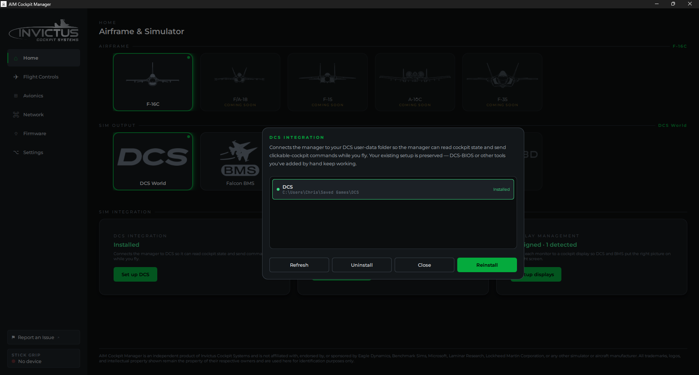
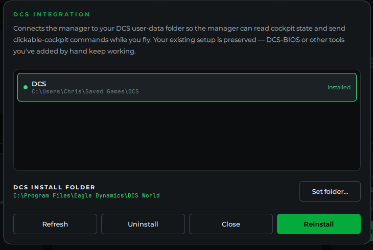
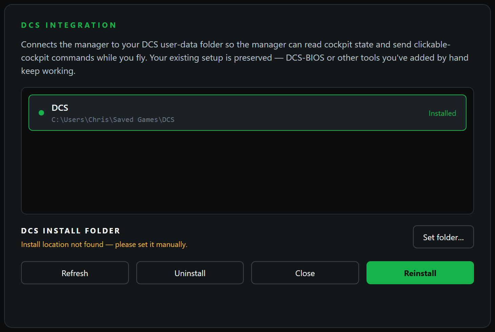

# Set Up DCS

**What you'll do:** install the DCS integration from the manager with one click, so your cockpit controls send commands to DCS World and your cockpit lights and displays update from the sim.

## Before you begin

- DCS World 2.9 or newer is installed and has been launched at least once (so its Saved Games folder exists).
- The manager is installed and running. See [Install the Manager](install-the-manager.md).
- At least one board is configured. See [Add Your First Board](add-your-first-board.md).

## Steps

### 1. Open the DCS Integration card

From the manager home page, click the **DCS** icon, then scroll down to the **DCS Integration** card.

The card lists every DCS variant the manager detected under your Saved Games folder, typically **DCS** and **DCS.openbeta**, and shows the install status for each. If a variant you expect to see isn't listed, it means DCS hasn't been launched yet and its Saved Games folder doesn't exist.

### 2. Install the integration

Click **Install**. The manager installs the integration into every detected variant at once:

- Copies **AIM_export.lua** and its supporting library files into `Saved Games\[variant]\Scripts\AIM\`
- Adds a single load line to `Scripts\Export.lua` so DCS picks them up automatically on launch

If you already have other tools hooked into `Export.lua` (such as other export scripts), the manager adds its line alongside them without disturbing anything else.

> [!NOTE]
> If the card shows **Update available** rather than **Install**, a newer version of the integration is bundled with this version of the manager. Click **Update** to replace the older files. The process is identical to a fresh install.

### 3. Check the DCS install folder (only for cockpit displays)

You can **skip this for a controls-only setup**. It only matters if you're putting a cockpit display like the F-16C RWR on a monitor.

The card also shows your **DCS install folder**, where DCS World and its aircraft modules are installed. This is separate from the Saved Games folder above, and the manager needs it to apply aircraft display fixes such as the F-16C RWR display patch (see [Cockpit Displays in DCS](cockpit-displays-in-dcs.md)).

The manager finds this automatically for most setups, **including DCS installed on a different drive from your Saved Games folder**. When it's found, the path shows in green:

If DCS is installed somewhere unusual and the manager can't find it, the path turns into a yellow warning. Click **Set folder…** and choose your main DCS folder. The one that contains the `Mods` and `bin` folders. The manager remembers it for next time.

### 4. Launch DCS

Start DCS World and load into the F-16C. The integration activates automatically. No in-game steps required.

### 5. Confirm the connection

Back in the manager, the DCS Integration card should show **Connected**. If you're sitting on the DCS main menu rather than in a cockpit it may show **Waiting**. That's normal; it connects once you're in an aircraft.

<!-- TODO image (Connected status is a planned manager feature, not yet available):  -->

## Check it worked

Flip a switch on your cockpit panel. The corresponding switch in DCS should move. If your aircraft has cockpit indicator lights or displays wired to your panel hardware, they should update to match the sim state.

## If something's wrong

| Problem | Fix |
|---|---|
| Status stays at "Not installed" after installing | Check that DCS has been launched at least once so the Saved Games folder exists, then reinstall. |
| Status shows "Installed" but never "Connected" | Make sure DCS is running and you're loaded into a mission, not sitting on the main menu. |
| Controls reach the manager but nothing happens in DCS | Confirm you're in the F-16C. The integration is aircraft-specific. Other aircraft are not yet supported. |
| A switch moves in the manager live view but not in DCS | The control may not be simulated in DCS. Hover the control in the manager. The tooltip will say if it's not modeled. |
| The RWR display fix says no F-16C module was found | Your DCS may be installed on a different drive. In the DCS Integration card, click **Set folder…** and choose your main DCS folder (the one with `Mods` and `bin`). |

---

## Surviving DCS updates

DCS updates and repairs routinely wipe the integration files from Saved Games, which used to mean redoing this page's steps after every patch.

From manager **1.6.0**, the manager checks the integration at startup and reinstalls anything a DCS update removed or reverted: the export script, the aircraft patches, and your stick's input profile. When it repairs something you get a brief note; there's nothing to click. The behavior is controlled by **Repair DCS integration automatically** in the App Behavior section of [Settings](settings.md), on by default.

---

**Next:** [Cockpit Displays in DCS](cockpit-displays-in-dcs.md)
