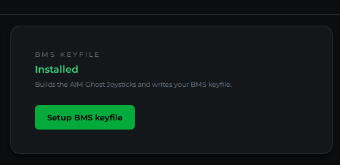

# Set Up Falcon BMS

**What you'll do:** install the AIM Ghost Joystick virtual driver, generate a BMS keyfile for your cockpit controls, and load it into Falcon BMS so your panels send inputs to the sim.

## Before you begin

- Falcon BMS 4.37 or newer is installed and has been launched at least once.
- The manager is installed and running. See [Install the Manager](install-the-manager.md).
- At least one board is configured with controls assigned. See [Assign Controls to Pins](assign-controls-to-pins.md).

> [!NOTE]
> BMS requires an **AIM Ghost Joystick** virtual driver to receive inputs from the cockpit network. The manager installs this for you as part of the BMS setup flow.

---

## How BMS integration works

BMS reads cockpit inputs from HID joystick devices, not from the network directly. The manager creates up to three **AIM Ghost Joystick** virtual devices on your PC, then generates a keyfile (`Invictus AIM F-16.key`) that maps every cockpit control to a button or axis on one of those virtual devices. Your physical boards send button presses over the network to the manager, which forwards them to the virtual joysticks, which BMS reads as standard controller input.

---

## Steps

### 1. Open the BMS keyfile dialog

On the manager home page, find the **BMS KEYFILE** card and click **Setup BMS keyfile**.

### 2. Install the driver (first time only)

The top section of the dialog shows the **AIM GHOST JOYSTICKS** status. If it reads **Not installed**, click **Install driver**. Windows will ask for administrator permission. This is required to install the device driver.

After the driver installs, click **Create [N] devices** to create the virtual joystick instances the catalog needs (usually 3 for a full F-16C setup).

The status changes to **[N] of [N] devices ready** once everything is set. See [Install the Virtual-Joystick Driver](install-the-virtual-joystick-driver.md) for more detail if anything goes wrong.

### 3. Select a template (optional)

The dialog shows the **TEMPLATE** it will merge your bindings into. The default is `BMS - Pitbuilder.key`, which is the right choice for most builders who also use a HOTAS alongside the cockpit panels.

If you use a different BMS key layout as your base, click **Browse…** and select it. Your keyboard and HOTAS bindings from that template are preserved; the manager only adds and updates the cockpit-panel bindings.

### 4. Run the export

Click **Run export**. The manager does two things:

1. **Pins the device order**. Writes `DeviceSorting.txt` in your BMS config folder so BMS always sees the AIM Ghost Joysticks at the correct device numbers. A timestamped backup of your existing file is made automatically.
2. **Generates the keyfile**. Writes `Invictus AIM F-16.key` to `[BMS install]\User\Config\`.

The result pane shows what was written. A green border means success.

> [!TIP]
> Click **Preview pin** first to see the DeviceSorting changes without writing them. This lets you check that the device order looks right before committing.

### 5. Load the keyfile in BMS

Open the BMS Launcher and load the keyfile in the Controllers setup. See [Load the Keyfile](load-the-keyfile.md) for the exact steps, including the critical launch setting that keeps your bindings from being overwritten every time you start BMS.

---

## Keeping the keyfile current

Any time you add controls, change pin assignments, or update the manager to a new version, the **BMS KEYFILE** card will show **Update available**. Open the dialog and run the export again. The process is identical to the first time.

---

**Next:** [Install the Virtual-Joystick Driver](install-the-virtual-joystick-driver.md) · [Load the Keyfile](load-the-keyfile.md)

**See also:** [Cockpit Displays in BMS](cockpit-displays-in-bms.md), [Assign Axes in BMS](assign-axes-in-bms.md)
