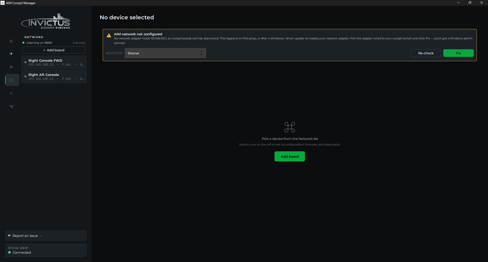

# Set Up the Cockpit Network

**What you'll do:** give your PC a second IP address on the cockpit subnet so the manager can find your boards.

Your boards and the manager talk to each other on a private subnet, `10.24.6.x`. Your PC needs to have the address `10.24.6.1` on the Ethernet adapter that's connected to the cockpit switch. This doesn't affect your internet connection; your other adapter (Wi-Fi or the one plugged into your router) keeps working normally.

> [!NOTE]
> Cockpits set up before manager v1.5.0 used the older `192.168.100.x` range. Those boards keep working without any changes: the Fix button binds both cockpit addresses, and brand-new boards (which start on the older range until configured) are found automatically. New boards are assigned `10.24.6.x` addresses going forward. The range moved because `192.168.100.1` is also the diagnostic address of every cable modem, which caused conflicts for cable-internet households.

## Before you begin

- Your cockpit Ethernet adapter is physically connected to your PoE switch.
- The PoE switch is powered on.
- The manager is installed and running. See [Install the Manager](install-the-manager.md).

## Option A: Let the manager do it (recommended)

The manager checks your network configuration when it launches. If it detects that the cockpit adapter doesn't have the right IP, it shows an alert on the **Network** page.



1. Click the adapter name in the alert to confirm it's your cockpit adapter (not your internet connection).
2. Click **Fix**. The manager will ask for administrator permission (one UAC prompt), add the cockpit addresses (`10.24.6.1`, plus the older `192.168.100.1` so every generation of board can connect), and verify the change. Fix also permanently reserves both cockpit ranges for that adapter, which prevents the Hyper-V/virtual-adapter conflict described below.
3. The alert disappears and the status updates to **Listening**.

That's it. The fix persists across reboots; you won't need to do this again unless Windows resets the adapter (sometimes happens after a major Windows update or driver reinstall. The manager will alert you again if it does).

## Option B: Set it manually

Use this if the automatic fix didn't work, or if you prefer to set it yourself.

### If your adapter is on a static IP (no DHCP)

1. Press `Win + R`, type `ncpa.cpl`, and press Enter.
2. Right-click your **cockpit Ethernet adapter** → **Properties**.
3. Select **Internet Protocol Version 4 (TCP/IPv4)** → **Properties**.
4. Click **Advanced…**
5. Under **IP addresses**, click **Add…**
6. Enter IP `10.24.6.1`, subnet mask `255.255.255.0` → **Add**.
7. Click **OK** through all three dialogs.

### If your adapter is set to DHCP

The Advanced → Add button is grayed out on DHCP adapters. Use PowerShell instead:

1. Right-click Start → **Terminal (Admin)** or **Windows PowerShell (Admin)**.
2. Find your cockpit adapter name:

    ```powershell
    Get-NetAdapter | Where-Object Status -eq 'Up'
    ```

    Note the `Name` column. It's usually `Ethernet`, `Ethernet 2`, or similar. Don't pick your Wi-Fi adapter.

3. Add the IP (replace `Ethernet` with your adapter's actual name):

    ```powershell
    New-NetIPAddress -InterfaceAlias "Ethernet" -IPAddress 10.24.6.1 -PrefixLength 24
    ```

    Then add the older cockpit address too. Unconfigured boards on earlier firmware first appear through it:

    ```powershell
    New-NetIPAddress -InterfaceAlias "Ethernet" -IPAddress 192.168.100.1 -PrefixLength 24
    ```

4. Confirm it took:

    ```powershell
    Get-NetIPAddress -InterfaceAlias "Ethernet" | Format-Table IPAddress, PrefixLength
    ```

    You should see both your original DHCP-assigned address **and** `10.24.6.1` in the list.

## Check it worked

Switch back to the manager. The Network page should show:

- Status: **Listening**
- No alert banner

Power on a board. Within a few seconds of it booting, a row should appear in the board list with a green or amber dot and the board's IP address. If you see it, you're done. Move on to [Add Your First Board](add-your-first-board.md).

## If boards still don't appear

Work through these checks in order:

**1. Link light on the switch port.** Look at the port your board is plugged into. There should be a green or amber LED. No light at all means a cable, PoE, or power issue. Swap the cable first.

**2. PoE standard.** Confirm your switch supports **IEEE 802.3at** (PoE+). Boards will not power up from an 802.3af (standard PoE) switch. Check your switch's specs.

**3. Right adapter.** The `10.24.6.1` address has to be on the adapter that's physically connected to the cockpit switch, not a virtual adapter or your Wi-Fi. Run `ipconfig` in a terminal and look for `10.24.6.1` under the correct adapter.

**4. Virtual adapters.** Hyper-V / WSL / VM virtual switches can land on `10.24.6.x` and hijack the cockpit subnet. See the next section.

**5. Windows Firewall.** If you dismissed the firewall prompt when the manager first launched, port 8888 inbound may be blocked. Check **Windows Defender Firewall → Allow an app through Windows Firewall** and make sure **AIM Cockpit Manager** is checked for **Private networks**.

**6. Still nothing?** See [Troubleshooting](troubleshooting.md) for deeper steps.

## Internet and the cockpit on one Ethernet port

The recommended setup is two adapters: one for internet, one dedicated to the cockpit switch. If your PC has a single Ethernet port that must carry both, read this first.

The Fix button *adds* `10.24.6.1` as a second address next to your existing one; it doesn't replace anything. On many setups internet keeps working afterward. But with two addresses on one adapter, Windows sometimes picks the cockpit address as the "from" address for internet traffic, and most home routers drop traffic that isn't from their own address range. The symptom: internet dies as soon as the cockpit address is added, and comes back when you remove it.

Two ways to solve it, best first:

1. **Add a second Ethernet port.** A USB Ethernet adapter (about $15) becomes the dedicated cockpit port, your motherboard port keeps the internet, and the two never interact. This is the setup everything else in this guide assumes.

2. **Move your router's network to `10.24.6.x`** (advanced, but proven by a cockpit builder). Everything, internet and boards, then shares one network:
   - Change the router's LAN range to `10.24.6.x`, and make sure the router itself is NOT at `10.24.6.1` (many default to `.1`; move it to something like `.254`).
   - Reserve `10.24.6.1` for your PC in the router's DHCP settings, so the PC always gets the address the boards call home to.
   - Keep the router's DHCP pool away from the board addresses: the manager assigns boards static addresses starting at `10.24.6.11` and counting up. A pool like `.200`-`.250` leaves plenty of room for phones and laptops while staying clear. (Your boards' assigned addresses are listed on the Network page.)
   - Plug the cockpit's PoE switch into the router. Boards, PC, and internet now share the network, and the manager's Fix banner should report everything healthy.

## Virtual adapters (Hyper-V, WSL, VMware, VirtualBox)

Hyper-V's **Default Switch** (and the WSL NAT) picks a random private subnet at every boot; VMware / VirtualBox host-only networks sit wherever you configured them. If one lands on `10.24.6.x`, two interfaces claim the cockpit subnet and Windows may route board traffic into the virtual switch, where it dead-ends. Because the Default Switch re-rolls per boot, the classic symptom is *"worked for weeks, broke after a reboot"* with a configuration that still looks correct.

From manager v1.5.0, the Network page warns you and names the offending adapter automatically, and the **Fix** button immunizes you: it installs a permanent route reservation for both cockpit ranges on your cockpit adapter at metric 1. Auto-created routes carry metric 256, so the reservation always outranks whatever a virtual switch grabs. If you've run Fix on v1.5.0 or newer, this conflict is already solved and you can stop reading. The manual fixes below are for older versions, or if you configured the IP by hand.

**Check which interface owns the cockpit subnet:**

```powershell
Get-NetRoute -DestinationPrefix 10.24.6.0/24 | Format-Table InterfaceAlias, RouteMetric
```

(Or just scan `ipconfig` for a `vEthernet` / `VMnet` adapter holding a `10.24.6.x` address.)

**Fixes, in order of preference:**

1. **Reserve the subnet for the cockpit NIC** (what Fix does on v1.4.0+; run it yourself on older versions). An explicit metric-1 route always beats the auto-created routes virtual adapters get. Admin PowerShell, replace `Ethernet` with your cockpit adapter's name:

    ```powershell
    New-NetRoute -DestinationPrefix "10.24.6.0/24" -InterfaceAlias "Ethernet" -RouteMetric 1
    ```

2. **Re-home the virtual network.** For switches you created yourself, rebuild the NAT on a range outside `10.24.6.0/24` (e.g. `192.168.200.0/24`). The auto-generated Default Switch can't be pinned. Use the metric fix for that one.

3. **Disable the vEthernet adapter** (`ncpa.cpl` → right-click → *Disable*) while using the cockpit, if you rarely need the hypervisor.

---

**Next:** [Add Your First Board](add-your-first-board.md)
