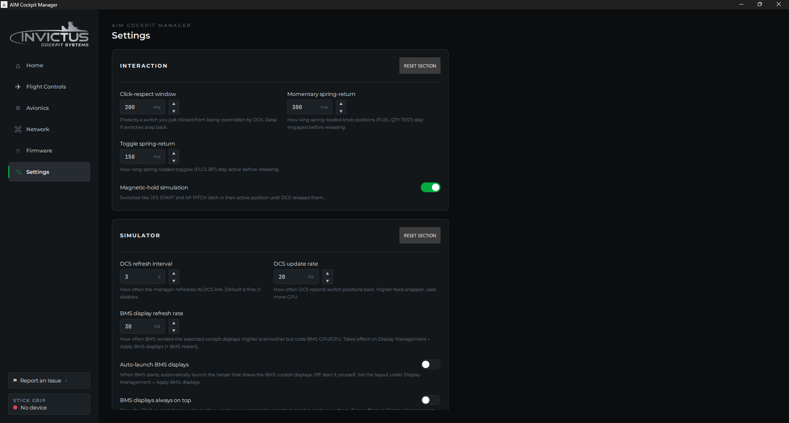

# Settings

The Settings page controls how the manager behaves: interaction timing, sim connection, display preferences, and software updates. All settings take effect immediately and persist automatically. There is no Apply button.

Each section has a **Reset section** button that restores just that section to defaults. **Reset all to defaults** at the bottom restores everything.

---

## Interaction

These settings control how the manager handles the timing of cockpit switch actions.

**Click-respect window** *(default: 600 ms)*

After you click a switch in the manager, it ignores incoming state updates from DCS for this duration. This prevents DCS from immediately snapping the switch back to its in-sim position when you're trying to move it. Raise this value if switches snap back after clicking.

**Momentary spring-return** *(default: 300 ms)*

How long a spring-loaded knob position stays engaged before the manager releases it. Applies to controls like FUEL QTY TEST that have a momentary detent. The manager holds the position for this duration then returns automatically.

**Toggle spring-return** *(default: 500 ms)*

How long a spring-loaded toggle stays active before releasing. Applies to toggles like FLCS BIT that spring back after being held.

**Magnetic-hold simulation** *(default: on)*

Some switches in the real F-16 latch magnetically and stay in their active position until released by the aircraft's systems. When this is on, switches like JFS START and AP PITCH hold in their engaged position in the manager until DCS signals them to release. Turn off if you want the manager to spring back immediately regardless of sim state.

---

## Simulator

**DCS refresh interval** *(default: 3 s)*

How often the manager refreshes its connection to DCS. The default is fine for normal use. Setting this to 0 disables periodic refresh.

**DCS update rate** *(default: 20 Hz)*

How often DCS sends cockpit state updates back to the manager. Higher values feel more responsive but use more CPU. 20 Hz is a good balance; 60 Hz is the maximum.

**BMS display refresh rate** *(default: 30 Hz)*

How often BMS renders the exported cockpit display textures that RTTClient draws on your secondary monitors. Higher is smoother but costs BMS GPU and CPU. This setting takes effect the next time you click **Apply BMS Displays** in the Multi-Display Management dialog and restart BMS.

**Auto-launch BMS displays** *(default: off)*

When enabled, the manager detects when BMS starts running and automatically launches RTTClient. When off, you start RTTClient yourself by navigating to `[BMS install]\Tools\RTTRemote\RTTClient64.exe`. See [Cockpit Displays in BMS](cockpit-displays-in-bms.md).

**BMS displays always on top** *(default: on)*

Draws RTTClient's cockpit display windows above other windows on secondary monitors, so they aren't covered by the taskbar. Takes effect the next time you click **Apply BMS Displays** and restart BMS.

---

## Display

**Show control hints** *(default: on)*

Shows a description when you hover a cockpit control in the Panels view. Useful while learning the panels; turn off for a cleaner view once you know the layout.

**Hint display delay** *(default: 400 ms)*

How long you hover before a control hint appears. This setting is grayed out when Show control hints is off.

---

## Software

**Check for updates on launch** *(default: on)*

Automatically checks the manager release page each time the app starts and shows a banner if a newer version is available. See [Update the Manager](update-the-manager.md).

**Version and update status**

Shows the installed manager version and whether an update is available. The **CHECK NOW** button triggers a manual check. If an update is available, a **GET UPDATE** button opens the releases page. See [Update the Manager](update-the-manager.md).

---

**See also:** [Cockpit Displays in BMS](cockpit-displays-in-bms.md), [Update the Manager](update-the-manager.md)
