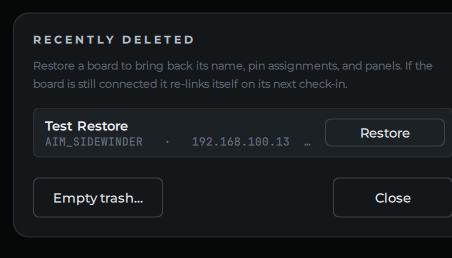

# Swap or Replace a Board

**What you'll do:** move a board's full configuration (panels, pin assignments, and calibration) to a replacement board without redoing the setup wizard.

This is useful when a board needs to be exchanged under warranty, or when you're re-using a pin map from one build in another.

## Before you begin

- You have access to the board you want to copy the config *from* (the source board), or you have a previously exported config file.
- The replacement board is connected to your cockpit network and showing as **NEW** or **UNCONFIGURED** in the manager.

---

## Export the config from the source board

1. Open the **Network** page and click the board you want to export from.
2. Click **Export Config**. The manager saves a `.json` file. Save it somewhere you'll find it, like your desktop.

> [!TIP]
> Export a config backup any time your board is fully set up and working. If you ever need to restore it, or adopt it onto a replacement, you'll be glad you have it.

---

## Import the config onto the replacement board

1. Click the replacement board (the one showing **NEW** or **UNCONFIGURED**), then click **Register** to open the setup wizard.
2. On the wizard's first step (**Identity**), click **Import config from file…** instead of filling in the fields by hand.
3. Select the `.json` file you exported. The wizard fills in the name, panels, pin assignments, and calibration from the file.
4. Click through to the **Review** step and **Save & Upload** to push the full configuration to the replacement board.

The board reboots, applies the config, and reappears with the same name as the original. All controls should work exactly as they did on the source board.

---

## If the boards are different models

A Sidewinder config imported onto a Phoenix (or vice versa) will import what it can, but some assignments may not transfer:

- **GPIO pins** that exist on the source board but not the destination are left unassigned. You'll see them highlighted in the pin assignment view.
- **ADC channels** follow the same rule.

After importing, check the live view for each panel and reassign any controls that didn't transfer.

---

## Removing a board from the registry

If a board is permanently gone and you want to remove it from the manager's board list:

1. Click the board on the Network page.
2. Click **Delete**. The manager will ask you to confirm before removing it.

### Recover a board you removed

Removing a board is **reversible**. It goes to a "Recently deleted" bin rather than being erased. If you delete the wrong board or change your mind, open the **Network** page and click **Recently deleted** at the bottom of the board list, then **Restore**. The board comes back with its name, pin assignments, and panel layout intact (and a connected board re-links itself on its next check-in). The same dialog has an **Empty trash** button to clear removed boards permanently when you're sure.

> [!NOTE]
> Removing a board from the manager doesn't reset the board itself. If you plug the old board back in, it will reappear as a new board. You can then import a saved config onto it. See [Export the config from the source board](#export-the-config-from-the-source-board) above for why keeping a config backup is a good habit.

---

**See also:** [Add Your First Board](add-your-first-board.md), [Assign Controls to Pins](assign-controls-to-pins.md), [Troubleshooting](troubleshooting.md)
