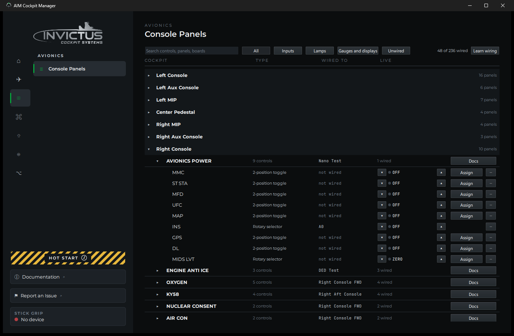
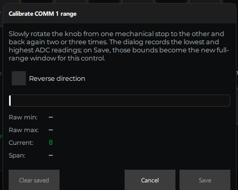

# Test and Calibrate

**What you'll do:** verify that every wired control reads correctly in the manager, and calibrate your potentiometers so their full travel maps cleanly to the sim.

## Before you begin

- At least one panel has pins assigned. See [Assign Controls to Pins](assign-controls-to-pins.md).
- Your controls are physically wired to the board.

---

## Live panel view

Every panel in the manager has a **Live** view that shows real-time state for every control on that panel. No simulator needed.

Open a panel, then click the **Live** tab (or **Test** button, depending on your manager version).

Flip a switch or turn a knob on the physical board. The matching control in the live view should respond immediately. Work through each control one at a time.

### Reading the live view

| What you see | What it means |
|---|---|
| Switch flips in sync with the physical switch | Correct wiring and pin assignment |
| Switch doesn't respond at all | Wrong pin number, or wiring issue; see below |
| Switch always shows as ON | GND and GPIO are shorted, or the switch is normally-closed |
| Pot bar moves when you turn the knob | Correct wiring and ADC assignment |
| Pot bar doesn't move | Wrong ADC channel or wiring issue; see below |
| Pot bar moves but is noisy/jittery | Long wiring run picking up noise, or an unwired pot channel; see below |

---

## Calibrate a potentiometer

Raw pot readings rarely span the full range the sim expects. Calibration tells the manager what the physical minimum and maximum positions are, so it can translate them accurately.

### Steps

1. In the live view, right-click the pot you want to calibrate and select **Calibrate**.
2. Slowly turn the knob back and forth through its full range of travel several times. The manager watches the incoming values and captures the range automatically. No buttons to click while sweeping.
3. When the reading looks stable and the bar spans the full range, click **Save**.

If the result doesn't look right, the bar starts mid-range, or stops short, click **Clear** to discard the captured values and sweep the knob again from scratch.

> [!TIP]
> If the pot reads backwards (turning clockwise decreases the value instead of increasing it), tick **Reverse direction** in the calibration dialog. It flips the pot's travel instantly, no rewiring and no reboot, and any range you've already calibrated is flipped to match. (If you'd rather fix it in hardware, swapping the pot's 3.3V and GND wires does the same thing.)

---

## Diagnosing problems

### Right-click fixes for switches

Every control in the live view has a right-click menu, and two entries solve the most common switch complaints without touching a soldering iron:

**Invert switch wiring** *(manager 1.5.0 and later)*: if a toggle reads backwards (up shows as down), it was wired to the opposite throw. This flips it in software, instantly, and the fix persists with the board's configuration. No rework, no reboot.

**Adjust response time** *(manager 1.6.0 and later)*: how long the board waits for a switch's contacts to settle before reporting a new position. Raise it if a rotary switch briefly snaps back to its previous position when you turn it; lower it if a control feels slow. Saving sends the change to the board, which restarts for a moment. Rotaries default to 100 ms.

### A switch doesn't respond

1. **Check the pin assignment.** In the panel view, confirm the control is assigned to the correct GPIO pin number.
2. **Check the wiring.** With the board powered, use a multimeter in continuity mode across the switch terminals to confirm it's switching. Then confirm the wire from the GPIO pin goes all the way back to the board header. No broken joints.
3. **Try a neighboring pin.** Temporarily assign the control to an adjacent pin and bridge that pin to GND with a wire. If the manager responds, the original pin is fine and the issue is in the wiring to that pin. If it still doesn't respond, the pin may be damaged. Try a different one.

### A pot doesn't move

1. **Check the ADC channel.** Confirm the pot is assigned to an ADC channel (not a GPIO pin number).
2. **Check the supply wires.** The wiper wire carries the signal, but the pot needs 3.3V and GND connected to the outer terminals to produce a signal. Confirm both are wired.

### A pot is jittery or noisy

- **Unassigned potentiometer channels** float and read random values if nothing is connected to them. If you see jitter on a control you don't plan to wire, right-click it and select **Mute** to disable it. If you do plan to wire it later, you can ignore the jitter for now. It goes away once a pot is connected and calibrated.
- **Long wiring runs** can pick up interference. Try a shorter run or twisted-pair wiring between the pot and the board.
- **Dirty pot wiper.** On older pots, a worn wiper causes noise. Try exercising the knob through its full range a few times; if it doesn't improve, the pot may need replacing.

---

**Next:** [Swap or Replace a Board](swap-or-replace-a-board.md) or continue to [Set Up DCS](set-up-dcs.md)
