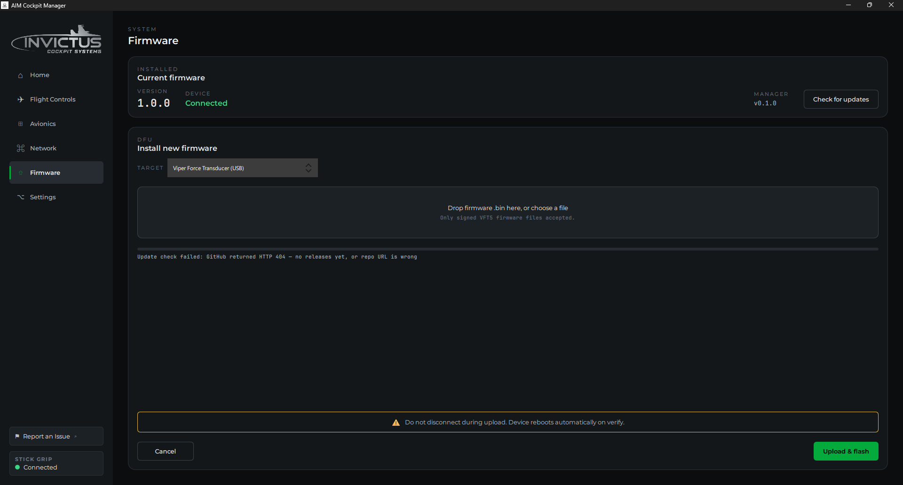

# Update Board Firmware

**What you'll do:** flash updated firmware onto a Sidewinder or Phoenix panel board using the manager's over-the-network update.

## Before you begin

- The board is powered on and showing as connected (green dot) on the Network page.
- You have a firmware `.bin` file for your board type (see below).

> [!TIP]
> OTA (over-the-air, meaning over the cockpit network) is the normal update path. You do not need to open anything or touch the board. USB flashing is a fallback for boards that are too new to have OTA-capable firmware already on them.

## Where to get firmware

Firmware is published on the [aim-panel-firmware releases page](https://github.com/invictuscockpits/aim-panel-firmware/releases). Each release has one file per board type:

- `SidewinderFirmware-<version>.bin` for the AIM Sidewinder
- `PhoenixFirmware-<version>.bin` for the AIM Phoenix

The two are not interchangeable. Download the one matching your board.

From manager v1.5.0, you don't need to visit the page at all: select your board on the Firmware page and click **Check for updates**. If a newer version exists, a banner appears with a **Download** button that stages the correct file for your board automatically; then click **Upload & flash**.

---

## Steps

### 1. Open the Firmware page

Click the **Firmware** icon in the manager sidebar.

> [!NOTE]
> The Firmware page is shared with the [VFT5 Side-Stick](vft5-side-stick.md). The target dropdown lists the Viper Force Transducer alongside any connected panel boards. Pick the panel board you want to update.

### 2. Select the target board

At the top of the page, use the dropdown to select the panel board you want to update. Each connected board appears as:

> **Panel · [Board name] · fw X.Y.Z**

The current firmware version is shown so you know what's already on the board.

### 3. Load the firmware file

Drag a firmware `.bin` file onto the drop area, or click inside it to browse for the file.

> **Drop firmware .bin here, or choose a file**

> [!NOTE]
> Make sure you're using the correct firmware for the board type. Sidewinder and Phoenix firmwares are not interchangeable.

### 4. Flash the board

Click **Upload & flash**. The manager sends the firmware to the board over the network. A progress bar and status line track the upload:

| Stage | Status shown |
|---|---|
| Starting | Preparing the board for the update… |
| Uploading | Sending firmware to the board… |
| Verifying | Verifying… |
| Done | Update verified, board rebooting |

The board reboots automatically when the update is complete and reappears in the Network page within a few seconds.

You can click **Cancel** during the upload or verify stages to abort. The board recovers on its own if a transfer is interrupted.

---

## If the board doesn't respond

If the board doesn't acknowledge the update request within 10 seconds, you'll see:

> The board didn't respond to the update request. Its firmware may be too old to update over the network. Update it over USB instead.

This means the firmware currently on the board predates OTA support. You'll need to flash it once over USB. Contact support for instructions specific to your board.

---

## If something's wrong

| Problem | Fix |
|---|---|
| Board doesn't appear in the dropdown | Check the Network page. The board must be connected and showing a green dot before it appears here. |
| Upload starts but fails partway through | Check the PoE switch link light. A momentary network dropout during transfer causes the board to abort. Try again. The board returns to its previous firmware if the new one doesn't verify. |
| Board reboots but comes back with the old firmware version | Verification failed and the board rolled back. Try again with a fresh copy of the firmware file. |
| Wrong board type flashed | The board will likely fail to boot. Flash the correct firmware over USB to recover. |

---

**See also:** [Update the Manager](update-the-manager.md), [Add Your First Board](add-your-first-board.md)
