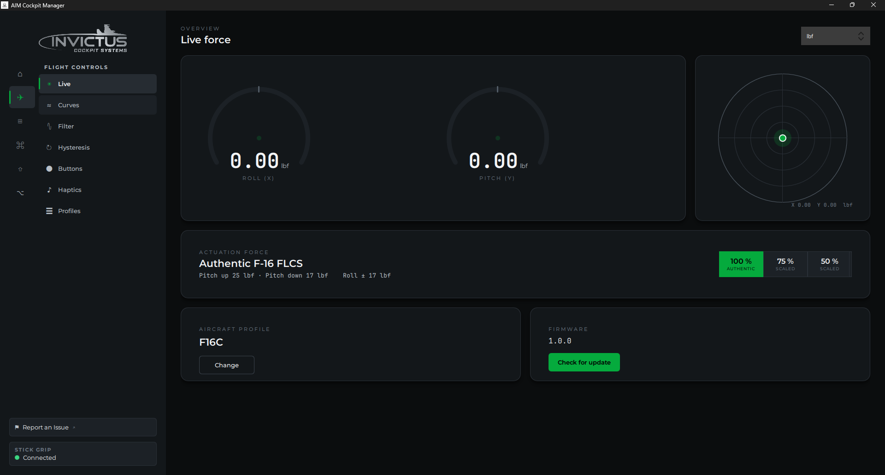
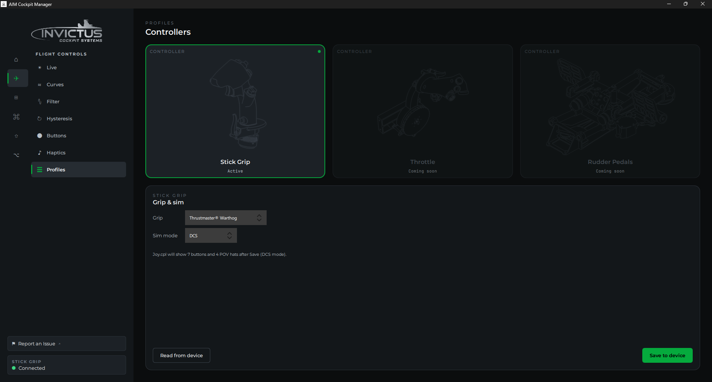
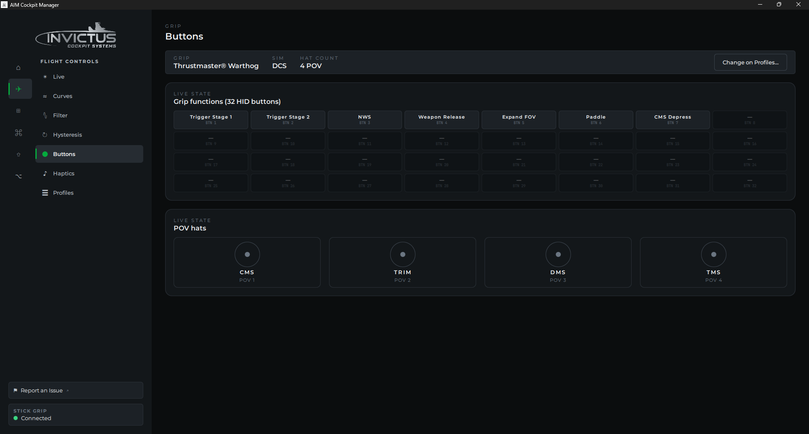
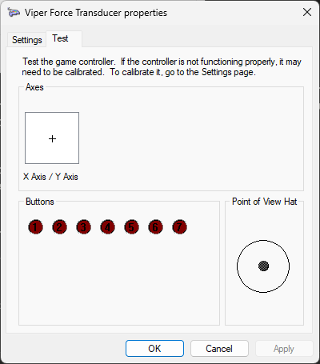

# VFT5 Side-Stick

The Viper Force Transducer Gen 5 (VFT5) is the Invictus USB side-stick controller for F-16C cockpit builds. It measures force applied to the stick rather than physical deflection. You push and the stick stays where it is, just like the real jet.

The VFT5 connects directly over USB and is configured through the manager's **Flight Controls** and **Firmware** pages. It does not use the AIM cockpit network or PoE. It's an entirely separate USB HID device.

---

## Connect the stick

Plug the VFT5 into any USB port on your PC using the supplied USB-C cable. Windows detects it as a standard HID joystick. No driver installation needed.

Once connected, the manager detects the stick and unlocks the **Firmware** and **Profiles** pages.

> [!NOTE]
> The VFT5 shows up as **VFT Gen 5 Controller** in Windows Settings → Bluetooth & devices → Controllers and in `joy.cpl`. The exact button and POV hat count shown depends on the grip profile currently saved to the stick.

---

## Check and update firmware

1. In the manager, go to the **Firmware** page.
2. The page shows the **firmware version** currently on the connected stick.
3. If a newer version is available, a **Download** button appears. Click it. The manager downloads the `.bin` file from the firmware releases page.
4. Once downloaded, click **Upload & flash**. The stick reboots into flash mode, receives the new firmware, and reconnects automatically.

The manager checks for new firmware automatically when it launches. You can also trigger a manual check via **Settings → CHECK NOW**.

> [!TIP]
> Firmware releases are published at [github.com/invictuscockpits/vft_gen5_firmware](https://github.com/invictuscockpits/vft_gen5_firmware). Release notes for each version are on that page.

---

## Set the grip profile

The VFT5 accommodates different physical grip types. The grip you attach determines how many buttons and POV hats the stick reports to Windows and your sim.

1. Go to **Flight Controls → Profiles** in the manager.
2. Select your grip from the **Grip** dropdown. The preview line shows how many buttons and POV hats Windows will see for that grip (for example: "joy.cpl will show 7 buttons and 4 POV hats").
3. Click **Save to device**. The manager sends the mapping to the stick and it reboots automatically.
4. After the reboot, Windows re-enumerates the stick with the correct button and POV count for your grip.

You only need to do this once, or when you physically swap to a different grip. The mapping is stored on the stick itself. It persists across power cycles.

The **Flight Controls → Buttons** page shows each grip function and POV hat live, so you can confirm the mapping by pressing buttons on the stick.

---

## Assign axes and buttons in your sim

The VFT5 appears as a standard HID joystick in DCS and BMS. Assign its axes and buttons the same way you would any other joystick:

**DCS:** Options → Controls → select the VFT5 device → bind axes and buttons.

**BMS:** Setup → Controllers → find the VFT Gen 5 Controller → bind axes.

The X and Y axes correspond to pitch and roll force. BMS and DCS both treat them as standard joystick axes.

To confirm Windows sees the stick correctly, open `joy.cpl` (Run → `joy.cpl`), select **Viper Force Transducer**, and click **Properties → Test**. You'll see the X/Y axes respond to force and the buttons light as you press them.

> [!TIP]
> Set a small deadzone around center in your sim's axis settings. Even with clean wiring, a force sensor will have a small amount of resting noise at true zero.

---

## If something's wrong

| Problem | Fix |
|---|---|
| Manager doesn't detect the stick | Check the USB cable and try a different port. Some USB hubs can cause enumeration issues. Connect directly to the PC. |
| Profiles page shows no grip options | The manager may not have connected to the stick yet. Wait a moment and check the Firmware page for a version number. If that's blank too, the stick isn't detected. |
| Wrong button count in joy.cpl | The grip profile on the device doesn't match what you selected. Open Profiles, select the correct grip, and click Save to device again. |
| Stick axes are reversed | Invert the axis in your sim's controller settings. |
| Firmware update fails | Make sure no other application (e.g., joy.cpl test panel) has the device open during the flash. Close them and try again. |

---

**See also:** [Update Board Firmware](update-board-firmware.md), [What You Need](what-you-need.md)
