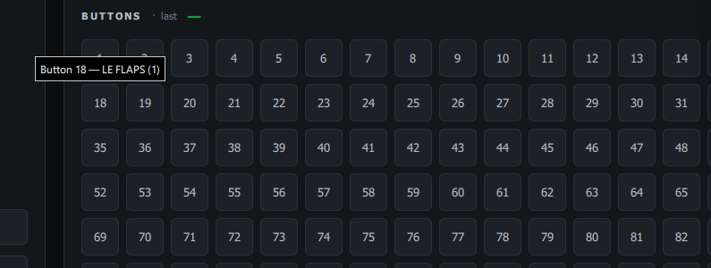

# AIM Ghost Joysticks

The AIM Ghost Joysticks are the virtual joystick devices the AIM Cockpit Manager
creates for Falcon BMS. Each one carries up to **128 buttons** — far past what
joy.cpl can show — which is the main reason this tool exists.

## Full 128-button map

Select an **AIM Ghost Joystick** in the sidebar and you'll see all 128 buttons
and its 8 axes, live.

## Button → cockpit control

Hover any button and AIM Joystick Probe tells you which **F-16C cockpit control**
it maps to — for example *Button 1 — FIRE & OHEAT*. The same label appears next
to the **last pressed** readout when you press it.

This makes it easy to confirm a panel control is reaching the right virtual
button before you bind it in BMS.

> The labels come from the AIM Cockpit Manager F-16C catalog. Buttons that aren't
> mapped to a control just show their number.
