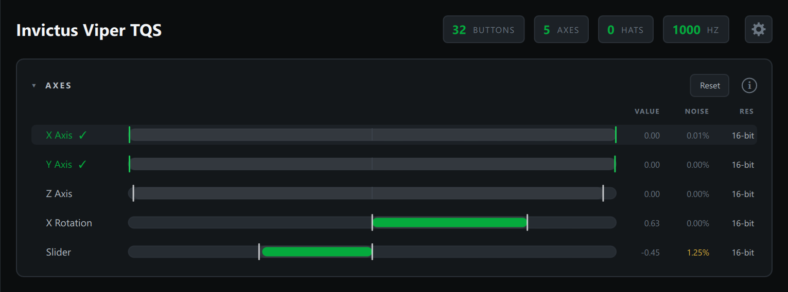
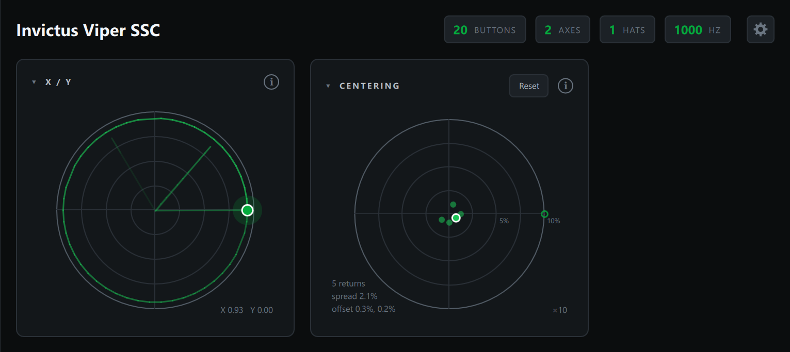
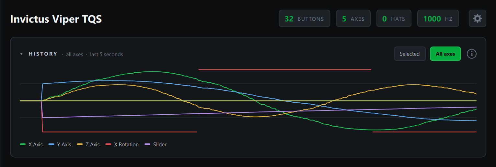

# Axes and Sensors

The Axes, X / Y, Centering and History cards show how your sensors really
behave: whether each axis reaches both ends, how much it jitters, how fine its
steps are, how cleanly the stick returns to center and what it did over the
last few seconds.

## Axes

Every axis gets a row. Its name comes from the device itself, the same name
Windows' Game Controllers panel shows (X Axis, Rotation, Slider, Dial, or a
name the manufacturer gave it). The bar fills from the center toward the
current position, and the columns on the right are:

- **Value**: the current position, from -1.00 to +1.00
- **Noise**: how much the reading jitters (see [Noise](#noise))
- **Res**: the axis's effective resolution (see [Resolution](#resolution))

Hover a row for the details, and click it to graph that axis in
[History](#history). **Reset** clears travel, noise and resolution so you can
measure afresh.

> A throttle or slider that rests at one end shows its bar fully filled and a
> value of -1.00. That's normal. Move it and the value changes.

### Travel and full range

The faint band on each bar and the two white markers show the furthest the
axis has gone in each direction since the last reset. Sweep an axis end to end
and the markers tell you whether it really reached both ends.

When an axis gets within 3% of both ends, its markers turn **green** and its
name gets a **✓**. In the screenshot above, X Axis and Y Axis have reached full
range, Z Axis stopped just short of one end, and X Rotation and Slider have
only moved part of the way.

### Noise

Noise is how much the reading jitters, shown as a percentage of the axis's full
travel. It's measured over the last second, on the small rapid wobble only, so
moving the axis doesn't count as noise. You can check a sensor while you use
it, not just at rest.

The value turns **amber** at 1% and **red** at 3%. A healthy Hall sensor or a
good potentiometer usually reads well under 0.5%. Higher numbers point to a
worn or dirty pot, a loose wire, electrical interference, or a power supply
problem. The Slider in the screenshot, at 1.25%, is a pot worth a look.

Hover the row to see the noise in raw counts and in device steps.

### Resolution

**Res** is the axis's effective resolution in bits: 8-bit, 10-bit, 12-bit,
16-bit and so on. The Probe works it out from the smallest step it actually
sees the axis move by, so it reflects what reaches the PC, not just what the
sensor's datasheet promises.

It reads **sweep** until it has seen enough. Move the axis slowly through part
of its range, or let it rest for a moment, and the number appears. Very fine,
quiet sensors can take a little longer, because the Probe needs to see
neighboring values.

## X / Y pad

The pad plots the first two axes as a dot moving through concentric rings, like
a radar scope. The dot shows the true reading, with no smoothing, so any
overshoot you see is the device's own.

The green **trail** shows the last 2 seconds of movement, fading with age.
Circle the stick around its full throw to see its **gate shape**: a round gate
draws a circle, a square gate draws a rounded square, and flat spots or dents
show up straight away. You can turn the trail off in
[Settings](settings-snapshots-and-diagnostics.md#settings).

## Centering

The Centering card is the middle 20% of the stick's travel magnified ten
times, with rings at 5% and 10%.

Each time you push the stick away from center and let it go, the Probe waits
for it to settle and marks where it came to rest with a green dot. The newest
one is larger, with a white ring. A small ring shows the live position.

- **Spread** is the largest distance between any two rest points. It's the
  stick's centering repeatability: a tight cluster means strong, consistent
  springs; a wide scatter means slop, friction or weak centering.
- **Offset** is the average rest point. A consistent offset to one side means
  the stick doesn't center on zero; a small offset is easily handled by a
  deadzone or by recalibrating.

Release the stick in different directions a few times for a useful reading.
**Reset** clears the rest points.

## History

History graphs the last 5 seconds. **Selected** shows the axis you clicked in
the Axes card; **All axes** draws every axis in its own color, with a legend
and matching color marks next to the axis names. Click an axis name in the
legend or in the Axes card to go back to graphing just that one. The choice is
remembered.

Use it to catch things too quick to see on a bar: spikes, dropouts, a sensor
that drifts after you let go, or an axis that steps instead of moving smoothly.

> Some devices, like 3D mice, count up while you push and roll over from one
> end to the other. The graph leaves a gap at each roll-over instead of drawing
> a line across, and roll-overs don't count as noise.
