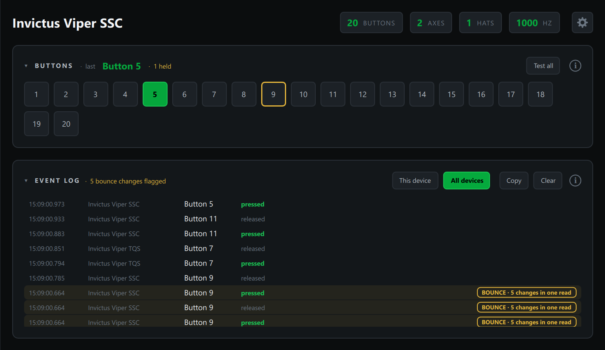

# Event Log

The Event Log records every button press and release and every hat move, with
the time to the millisecond, so you can see exactly what a control sent and in
what order.

## Reading the log

The newest event is at the top. Each row shows the time, the device, the
button or hat, and what happened: **pressed**, **released**, or a hat
direction such as **up-right**. On an AIM Ghost Joystick, the cockpit control
the button is mapped to is shown too.

**All devices** logs every connected controller, which is handy for finding
out which device a control belongs to. **This device** shows only the device
selected in the sidebar. The choice is remembered.

## Switch bounce

When a mechanical switch closes, its contacts can chatter for a few
milliseconds before they settle, so one press reaches the PC as several. Most
commercial controllers clean this up in firmware; DIY boards and button boxes
often don't, and in a sim it shows up as double inputs or a toggle that won't
stay put.

The Probe flags a button that changes state three or more times within 25
milliseconds. No finger can do that (even a fast double tap takes about a
tenth of a second), so it's always the switch. Flagged rows are tinted amber
with a **BOUNCE** badge saying how many changes happened and how fast, the
header counts them, and the button is outlined in amber in the Buttons card
until you clear the log.

If a switch bounces, add debouncing in your board's firmware, or replace a
worn switch.

> The Probe reads input every few milliseconds and keeps every change in
> order, so bounce that's over in a couple of milliseconds still shows up, even
> though the times on those rows may match.

## Copy and Clear

**Copy** puts the log on the clipboard as plain text, oldest first, ready to
paste into a forum post, an email or a support issue. With **This device**
selected it copies only that device's events. **Clear** empties the log and
resets the bounce flags.
