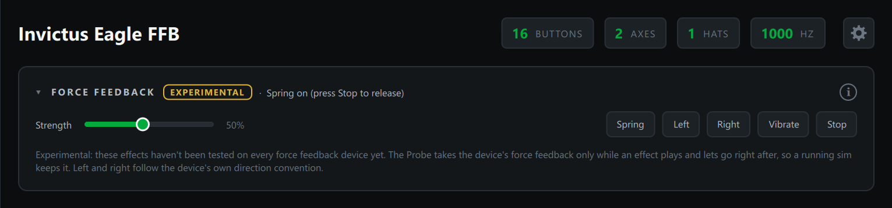

# Force Feedback

!!! warning "Experimental"
    Force feedback testing is new and hasn't been tried on every force feedback
    device yet. If an effect doesn't behave as described on your stick, please
    [report it](https://github.com/invictuscockpits/aim-joystick-probe-releases/issues)
    with the device's name and the [diagnostics report](settings-snapshots-and-diagnostics.md#copy-diagnostics).

When the selected device supports force feedback, a **Force Feedback** card
appears. Gamepads with rumble motors get a simpler **Rumble** card instead.
Devices without either don't show the card at all.

## Effects

- **Spring**: pulls the stick back to center, like a centering spring. It stays
  on until you press **Stop**.
- **Left** and **Right**: a short, steady push to one side. Which way counts as
  left follows the device's own direction convention, so on some sticks the two
  may be swapped.
- **Vibrate**: a one-second vibration.
- **Stop**: stops every effect and lets go of the device.

**Strength** sets how hard each effect is, from 10% to 100%. Start low on a
strong base.

## Using it alongside a sim

To play an effect, the Probe has to take the device's force feedback for
itself, which would stop a sim from using it. So it only holds the device while
an effect is playing and lets go the moment the effect ends or you press Stop.
If the card says it couldn't open force feedback, another program (usually the
sim) is using it; close that program or stop its force feedback, then try
again.
