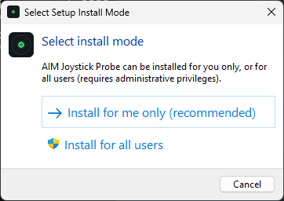
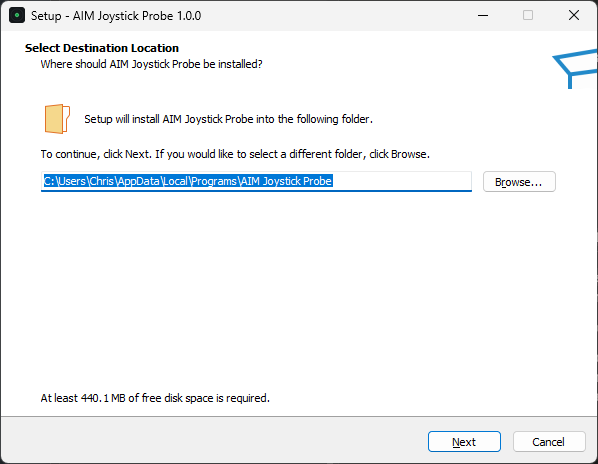
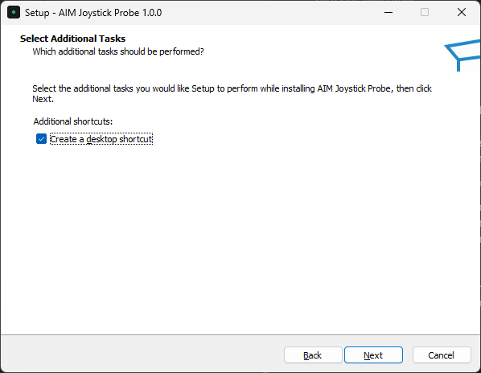
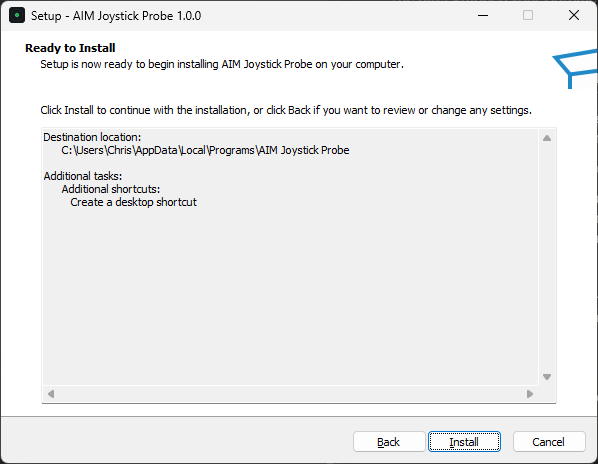
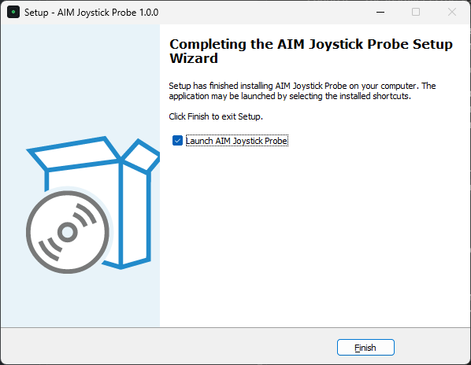
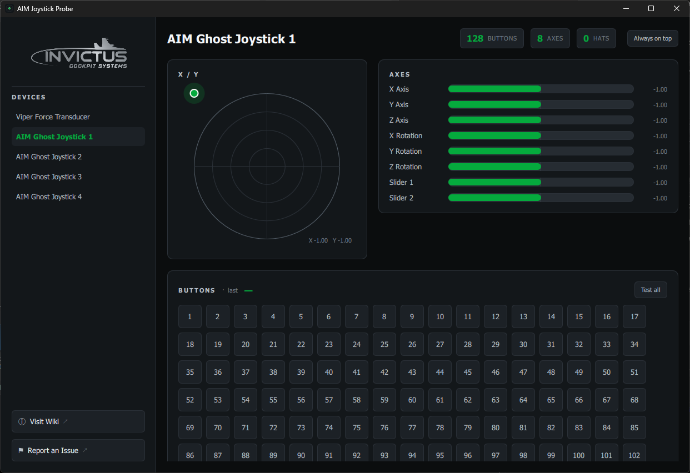

# Getting Started

## Requirements

- Windows
- A connected controller — joystick, throttle, gamepad, or an AIM Ghost Joystick

## Download

Grab the latest **AIM-Joystick-Probe-Setup.exe** from the
[Releases page](https://github.com/invictuscockpits/aim-joystick-probe-releases/releases).

## Install

Double-click the installer and follow the wizard. It's signed by Invictus
Machine LLC, so Windows won't flag it as coming from an unknown publisher, and
it installs **just for you** — no administrator rights needed. The whole thing
takes about a minute.

1. **Choose how to install.** Pick **Install for me only** — this is the
   recommended option and needs no administrator prompt.

   

2. **Confirm where it goes.** The default location is right for almost everyone.
   Click **Next**.

   

3. **Desktop shortcut.** Leave **Create a desktop shortcut** checked if you'd
   like one on your desktop, then click **Next**.

   

4. **Review and install.** Check the summary and click **Install**.

   

5. **Done.** Click **Finish**. Leave **Launch AIM Joystick Probe** checked to
   open it straight away.

   

> Running from source instead? Install the dependencies and launch:
>
> ```
> pip install -r requirements.txt
> python run.py
> ```

## The window at a glance



- **Sidebar** — your connected controllers. Click one to select it; the selected
  device's name turns **green**. Plug a controller in and it appears
  automatically.
- **X / Y pad** — the first two axes plotted as a moving dot, like a radar scope.
- **Axes** — every axis with its live position, using the familiar joy.cpl names
  (X Axis, Y Axis, Z Axis, X/Y/Z Rotation, Sliders).
- **POV Hats** — each hat shown as a direction pad.
- **Buttons** — every button; each lights green when pressed.

At the bottom of the sidebar are **Visit Wiki** and **Report an Issue** links.
