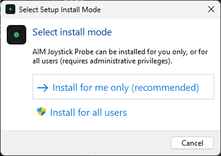
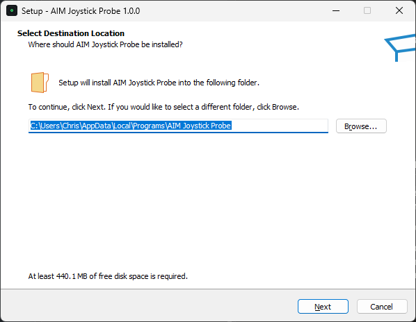
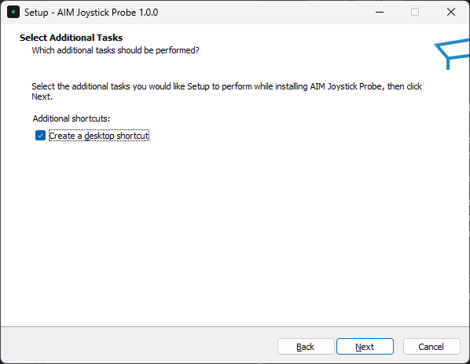
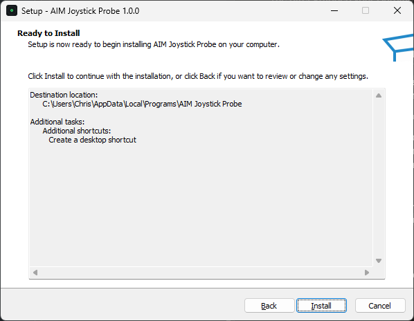
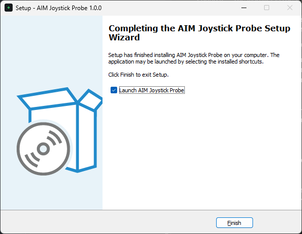

# Getting Started

## Requirements

- Windows
- A connected controller: joystick, throttle, gamepad, or an AIM Ghost Joystick

## Download

Grab the latest **AIM-Joystick-Probe-Setup.exe** from the
[Software page at invictuscockpits.com](https://invictuscockpits.com/pages/software).

## Install

Double-click the installer and follow the wizard. It's signed by Invictus
Machine LLC, so Windows won't flag it as coming from an unknown publisher, and
it installs **just for you**, with no administrator rights needed. The whole thing
takes about a minute.

1. **Choose how to install.** Pick **Install for me only**. This is the
   recommended option and needs no administrator prompt.

   

2. **Confirm where it goes.** The default location is right for almost everyone.
   Click **Next**.

   

3. **Desktop shortcut.** Leave **Create a desktop shortcut** checked if you'd
   like one on your desktop, then click **Next**.

   

4. **Review and install.** Check the summary and click **Install**.

   

5. **Done.** Click **Finish**. Leave **Launch AIM Joystick Probe** checked to
   open it straight away.

   

> Running from source instead? Install the dependencies and launch:
>
> ```
> pip install -r requirements.txt
> python run.py
> ```

## The window at a glance


**Sidebar.** Your connected controllers. Click one to select it; the selected
device's name turns **green**. Plug a controller in and it appears
automatically. Any device you touch shows a green dot and a badge naming the
input, even when it isn't selected (see
[Which device is that?](reading-your-controller.md#which-device-is-that)).
At the bottom: **Save snapshot**, **Copy diagnostics**, **Visit Wiki** and
**Report an Issue**.

**Header.** The selected device's name and counts of its buttons, axes and
hats, its [report rate](reading-your-controller.md#report-rate) in Hz, and
the **settings gear** (see
[Settings](settings-snapshots-and-diagnostics.md#settings)).

**Cards.** Each part of the device has its own card:

- **X / Y**: the first two axes plotted as a moving dot, with a trail
- **Centering**: where the stick comes to rest each time you let go, magnified
- **Axes**: every axis with its travel, noise and resolution
- **History**: the last 5 seconds of one axis or all of them
- **POV Hats**: each hat as a direction pad
- **Force Feedback**: test effects on force feedback devices (experimental)
- **Buttons**: every button; each lights green when pressed
- **Event Log**: every press, release and hat move, with switch bounce flagged

Click a card's title to collapse it to its header, and the **(i)** in its
corner to open its section of this guide. Cards only appear when the device
has what they show, and you can hide any of them in Settings.
