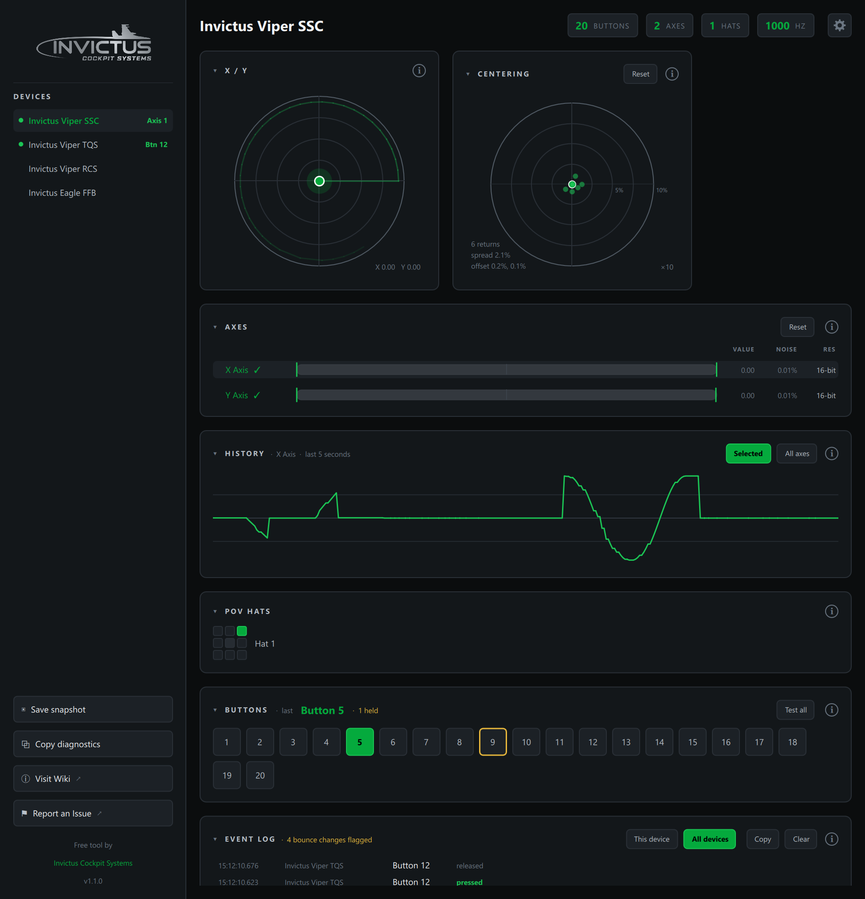

# AIM Joystick Probe

A free joystick tester for Windows built for cockpit builders. It shows a
controller's **complete** button map (all **128** buttons of an AIM Ghost
Joystick, not the 32 Windows' built-in **joy.cpl** stops at), and it measures
what matters when you build or troubleshoot hardware: axis travel, noise and
resolution, stick centering, switch bounce and report rate.

## Why it exists

Windows' Game Controllers panel (`joy.cpl`) reads sticks through the legacy
**WinMM** API, which caps button reporting at **32**. AIM Ghost Joysticks expose
128 buttons, so joy.cpl can't show most of them. AIM Joystick Probe reads the
device through DirectInput instead, so every button, axis and POV hat shows up.

It works with any controller: sticks, throttles, pedals, button boxes and
gamepads.

## What you can do

- See live **buttons, axes and POV hats** for any connected controller, with
  the axis names the device itself reports
- Spot **which device** a control belongs to: any device you touch lights up
  in the sidebar
- Check every axis for **full travel**, **noise** and **resolution**
- Watch the stick's **gate shape** and test its **centering**
- Graph axes over the last **5 seconds**
- Log every press and release, with **switch bounce** flagged
- Walk a whole panel with **Test all**, buttons and axes
- Read each device's **report rate** in Hz
- Try **force feedback** effects on FFB sticks (experimental)
- Save a **snapshot** or copy a **diagnostics report** for support
- Choose what's on screen in **Settings**, and collapse any card

Every card has an **(i)** icon in its corner that opens its section of this
guide.

## Pages

- [Getting Started](getting-started.md)
- [Reading Your Controller](reading-your-controller.md)
- [Axes and Sensors](axes-and-sensors.md)
- [Event Log](event-log.md)
- [Test-All Mode](test-all-mode.md)
- [Force Feedback](force-feedback.md)
- [Settings, Snapshots and Diagnostics](settings-snapshots-and-diagnostics.md)
- [AIM Ghost Joysticks](aim-ghost-joysticks.md)
- [Updates](updates.md)
- [FAQ](faq.md)
