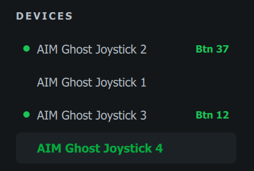

# Reading Your Controller

Select a device in the sidebar and everything below updates live (about 60 times
a second), even when the window isn't focused.

## Which device is that?

The sidebar watches every connected device, not just the one you have
selected. Press a button, move a hat or move an axis on any controller and its
row lights a green dot with a badge naming the input, such as **Btn 37**,
**Hat 1** or **Axis 2**. The badge fades after about a second and a half. Click
the row to open that device.

> **Crowded setup tip:** with several sticks, throttles and button boxes plugged
> in, press the control you're unsure about and watch which row lights up. No
> need to click through each device to find it.

Small wobble on an axis doesn't count as movement, so a noisy pot won't keep a
row lit.

## Buttons

Each button lights **green** while held. The BUTTONS header shows the **last
button pressed** and how many are currently **held**.

> **Binding tip:** when you're assigning controls in DCS or BMS, press the button
> on your stick and read its number straight off the **last pressed** readout —
> no counting rows.

If you see a held count without touching anything, that button may be stuck or
wired closed.

## Axes

Axes are listed with the standard Windows names — X Axis, Y Axis, Z Axis,
X/Y/Z Rotation, Slider 1/2. The bar fills from the centre toward the current
position, with the exact value (−1.00 … +1.00) on the right.

> A throttle or slider that rests at one end shows its bar fully filled and a
> value of −1.00. That's normal — move it and the value changes.

## X / Y pad

The pad plots the first two axes as a glowing dot moving through concentric rings,
like a radar scope. Use it to check centring and full deflection at a glance.

## POV hats

Each hat shows as a 3×3 pad; the active direction lights green, including
diagonals.
