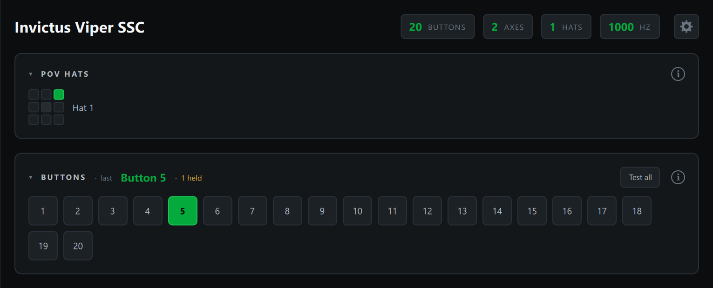

# Reading Your Controller

Select a device in the sidebar and everything updates live (about 60 times a
second), even when the window isn't focused. This page covers the sidebar, the
header, buttons and hats. Axes and the stick tools have their own page:
[Axes and Sensors](axes-and-sensors.md).

## Which device is that?

The sidebar watches every connected device, not just the one you have
selected. Press a button, move a hat or move an axis on any controller and its
row lights a green dot with a badge naming the input, such as **Btn 12** or
**Axis 1**. The badge fades after about a second and a half. Click the row to
open that device.

> **Crowded setup tip:** with several sticks, throttles and button boxes plugged
> in, press the control you're unsure about and watch which row lights up. No
> need to click through each device to find it.

Small wobble on an axis doesn't count as movement, so a noisy pot won't keep a
row lit.

**Identical devices.** When two devices report the same name (two of the same
button box, or several virtual joysticks), the Probe numbers them, for example
**Button Box (1)** and **Button Box (2)**, so the activity badges, the event
log and bounce tracking keep them apart.

## Report rate

The **Hz** pill in the header shows how often the selected device sends
updates to the PC. While the device is sending it shows the live rate; once it
goes quiet it shows the highest rate it reached, labelled **HZ PEAK**. Hover
the pill for the time between reports in milliseconds.

Most devices only send when something changes, so move an axis or press a
button to read the rate. Typical values are 125, 250, 500 or 1000 Hz. If a
device you expect to run at 1000 Hz reads much lower, check its firmware
settings and try a different USB port.

## Buttons

Each button lights **green** while held. The BUTTONS header shows the **last
button pressed** and how many are currently **held**.

> **Binding tip:** when you're assigning controls in DCS or BMS, press the button
> on your stick and read its number straight off the **last pressed** readout.
> No counting rows.

If you see a held count without touching anything, that button may be stuck or
wired closed.

A button outlined in **amber** has shown **switch bounce**: it flickered on
and off within a few milliseconds instead of changing once. See
[Switch bounce](event-log.md#switch-bounce).

To check every button on a panel in one pass, use
[Test-All Mode](test-all-mode.md).

## POV hats

Each hat shows as a 3×3 pad; the active direction lights green, including
diagonals. Hat moves also appear in the [Event Log](event-log.md).
