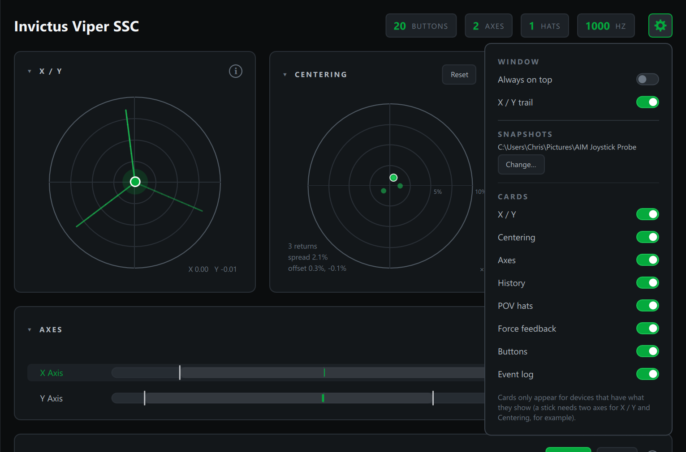

# Settings, Snapshots and Diagnostics

## Settings



Click the **gear** at the right of the header to open the settings panel.
Everything in it is remembered between launches.

- **Always on top** keeps the Probe above other windows, so you can read button
  numbers over a running sim while you bind controls.
- **X / Y trail** turns the [trail](axes-and-sensors.md#x-y-pad) on the X / Y
  pad on or off.
- **Snapshots** shows where [Save snapshot](#save-snapshot) puts its pictures.
  Click **Change…** to pick another folder, or **Default** to go back to
  Pictures\AIM Joystick Probe.
- **Cards** turns each card on or off: X / Y, Centering, Axes, History, POV
  hats, Force feedback, Buttons and Event log. A card you've turned on still
  only appears when the device has what it shows; a stick needs at least two
  axes for X / Y and Centering, for example.

## Collapsing cards

Click a card's title (or the small arrow next to it) to collapse the card to
its header, and click again to expand it. Each card remembers whether it's
collapsed. Headers keep their useful summaries while collapsed: Buttons still
shows the last button pressed, the Event Log still shows the bounce count, and
History still shows which axis it's graphing.

The **(i)** in each card's corner opens that card's section of this guide.

## Save snapshot

**Save snapshot**, at the bottom of the sidebar, saves the window as a picture,
named with the device and the date and time, and opens the folder with the file
selected so it's ready to attach to a forum post, an email or a support issue.
Choose the folder in [Settings](#settings).

## Copy diagnostics

**Copy diagnostics** puts a plain-text report on the clipboard. Paste it into a
support issue or an email and it answers most of the questions we would
otherwise have to ask:

- the Probe, pygame-ce, SDL and Windows versions
- every device the Probe sees, with its USB vendor and product IDs (VID / PID),
  button, axis and hat counts, and peak report rate
- **any game controller Windows sees that the Probe doesn't**, with its VID /
  PID and type, which is the key detail when a device is missing
- for the selected device, each axis's travel, noise and resolution, and any
  buttons that showed switch bounce

An example:

```
AIM Joystick Probe diagnostics
Probe 1.2.0 | pygame-ce 2.5.8 | SDL 2.32.10
Windows 11 (build 10.0.26200)

Devices the Probe sees (2):
  Invictus Viper SSC | VID 16D0 PID 1448 | 20 buttons, 2 axes, 1 hats | peak report rate 1000 Hz | GUID 03009c82d01600004814000000000000
  Invictus Viper TQS | VID 16D0 PID 1446 | 32 buttons, 5 axes, 0 hats | peak report rate 1000 Hz | GUID 03001d43d01600004614000000000000

Windows game controllers the Probe does not see:
  none, every game controller Windows reports is listed above

Selected device: Invictus Viper SSC
  X Axis: travel -1.00 to +1.00, noise 0.01%, resolution 16-bit
  Y Axis: travel -1.00 to +1.00, noise 0.01%, resolution 16-bit
  Switch bounce: Button 9
```
