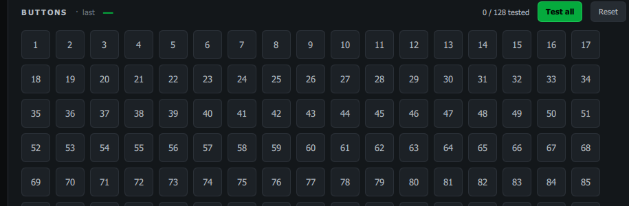

# Test-All Mode

A quick way to confirm **every** button on a controller works — especially handy
for the AIM Ghost Joystick's 128 buttons.

1. Click **Test all** in the BUTTONS header.
2. Press every button on your controller, one at a time.
3. Each button you press stays marked (dim green) once you release it, and the
   counter climbs — for example **42 / 128 tested**.
4. Anything still plain is a button you haven't hit yet (or one that isn't
   reporting).

Click **Reset** to start over. Switching devices resets the count automatically.

> This pairs nicely with the [AIM Ghost Joysticks](aim-ghost-joysticks.md) labels: hover a button you
> can't account for to see which cockpit control it should be.
