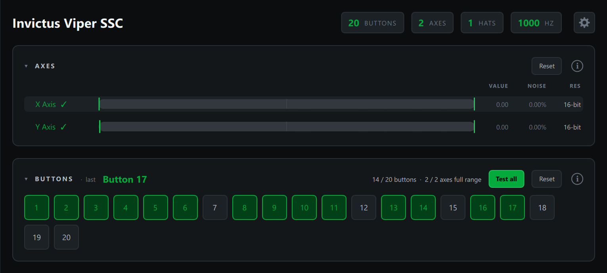

# Test-All Mode

A quick way to confirm **every** button and axis on a controller works,
especially handy on a freshly built panel or the AIM Ghost Joystick's 128
buttons.

1. Click **Test all** in the BUTTONS header.
2. Press every button on your controller, one at a time, and sweep every axis
   to both ends.
3. Each button you press stays marked (dim green) once you release it. Each
   axis that reaches both ends gets green markers and a ✓ in the Axes card.
4. The counter shows your progress, for example
   **14 / 20 buttons · 2 / 2 axes full range**.
5. Anything still plain is a button you haven't hit yet, or one that isn't
   reporting. An axis without a ✓ hasn't reached one or both ends.

Click **Reset** to start over; it clears the buttons and the axis travel
together. Switching devices resets the count automatically.

> This pairs nicely with the [AIM Ghost Joysticks](aim-ghost-joysticks.md)
> labels: hover a button you can't account for to see which cockpit control it
> should be.
