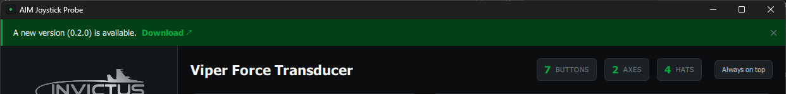

# Updates

AIM Joystick Probe checks for a newer version each time it launches. When one is
available, a banner appears across the top of the window:

- Click **Download** to open the release page in your browser.
- Click **✕** to dismiss the banner for the current session.

If you're offline, already on the latest version, or there are no releases yet,
no banner appears — the check fails quietly and never interrupts you.
