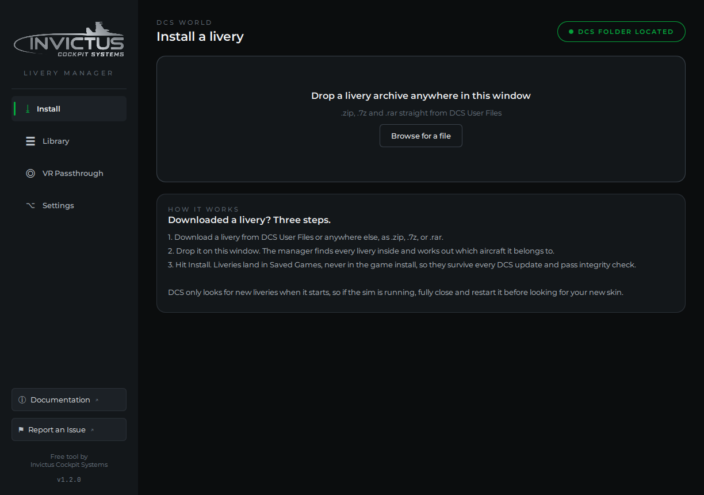
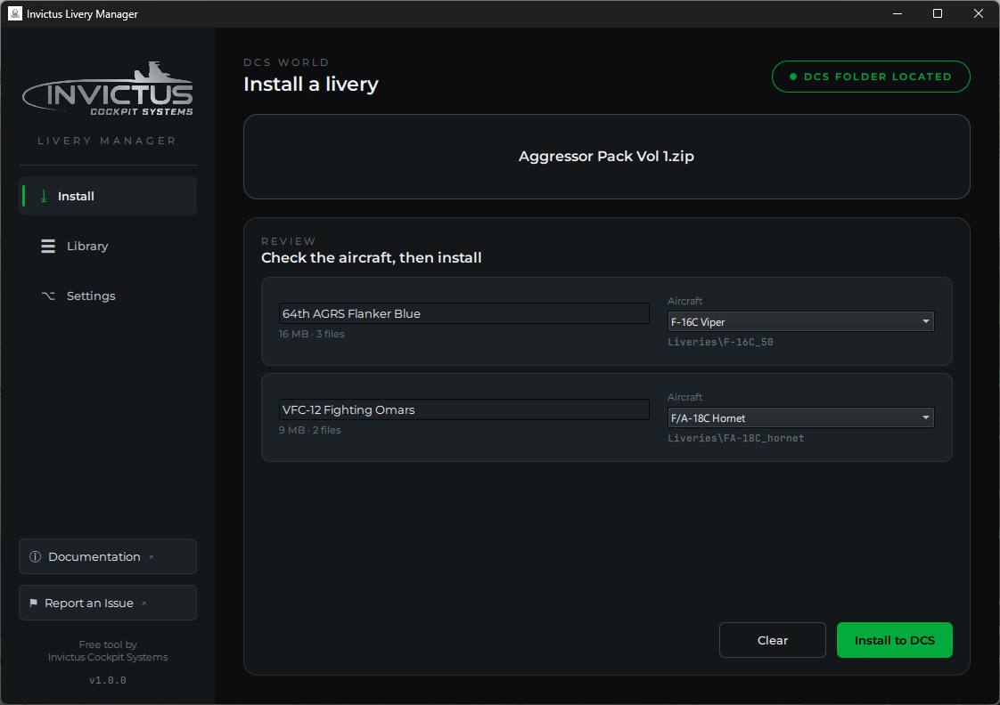

# Install a Livery

## 1. Get a livery

Download any livery as a `.zip`, `.7z`, or `.rar`. The
[DCS User Files](https://www.digitalcombatsimulator.com/en/files/?set_filter=Y&arrFilter_pf%5Bfiletype%5D=6)
section is the biggest source, but anything works. There's no need to unpack
it yourself.

## 2. Drop it on the window

Drag the archive **anywhere** onto the Livery Manager window, or click
**Browse for a file** on the Install page.

The manager unpacks the archive in the background and finds every livery
inside, however the author structured it. Multi-aircraft packs, archives
inside archives, and shared texture folders are all handled.

## 3. Review and install

Each livery found gets a row: its name (editable, if you'd like it listed
differently in DCS), the aircraft it belongs to, and exactly where it will go.

The aircraft is worked out from the archive's folder structure. When the
manager is confident, the picker is filled in and you can go straight to
**Install to DCS**. When it had to guess from the filename, or couldn't tell
at all, the row is outlined in yellow with a **Check the aircraft** note:
open the picker and choose the right aircraft before installing.

!!! warning "Fully close DCS to see your new livery"
    DCS only scans the Liveries folder **when it starts**. If the sim is
    running while you install, the livery will not appear until you **fully
    close DCS and launch it again**. In game, find it in the mission editor or
    rearm window under the aircraft's livery list.

## Reinstalling and updating

Installing a livery that's already there (say, the author released a v2) just
replaces it, no questions asked, as long as the original was installed by the
manager. If the existing folder was installed **by hand**, the manager stops
and asks before overwriting it.

## Where things actually go

Every livery is copied to
`Saved Games\<your DCS folder>\Liveries\<aircraft>\<livery name>`, alongside a
small manifest file that records where it came from and when. Nothing is ever
written into the DCS installation directory, which means:

- DCS updates and repairs never delete your liveries
- Multiplayer **integrity check** never complains about them
- Uninstalling the manager doesn't touch your collection

Some liveries reference a shared texture folder (packs often ship a `commons`
folder used by several skins). The manager detects this and installs the
shared folder too, and it never overwrites a shared folder that's already
there.
