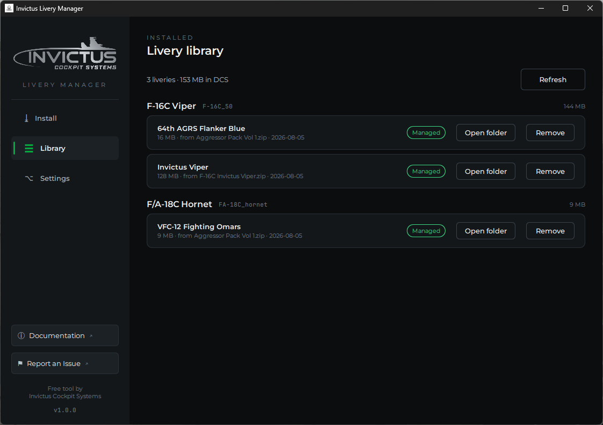

# The Library

The Library page shows every livery in your selected DCS folder, grouped by
aircraft, with per-livery and per-aircraft sizes and a running total at the
top.

## Managed vs Manual

Each row carries a provenance pill:

- **Managed** (green) — installed by the Livery Manager. The manager remembers
  which archive it came from and when, shown right under the name. Managed
  liveries can be re-installed, updated, or removed freely.
- **Manual** (gray) — found in your Liveries folder but **not** installed by
  the manager: you copied it in by hand, or another tool did. The manager
  lists it so you can see your whole collection, but it will never overwrite
  or delete a manual livery without asking you first.

## Removing a livery

Click **Remove** and confirm. The livery's folder is deleted from
`Saved Games\...\Liveries`, and if that leaves the aircraft's folder empty,
the empty folder is tidied away too. Removing a **Manual** livery shows a
stronger warning first, since it isn't the manager's to delete quietly.

!!! note
    Like installing, removing takes effect the **next time DCS starts**. A
    running sim keeps showing the livery until it's fully closed and
    relaunched. Missions that reference the removed livery fall back to the
    aircraft's default skin.

## Open folder

**Open folder** shows the livery in Windows Explorer — handy for checking
textures, editing `description.lua`, or zipping a livery up to share.
