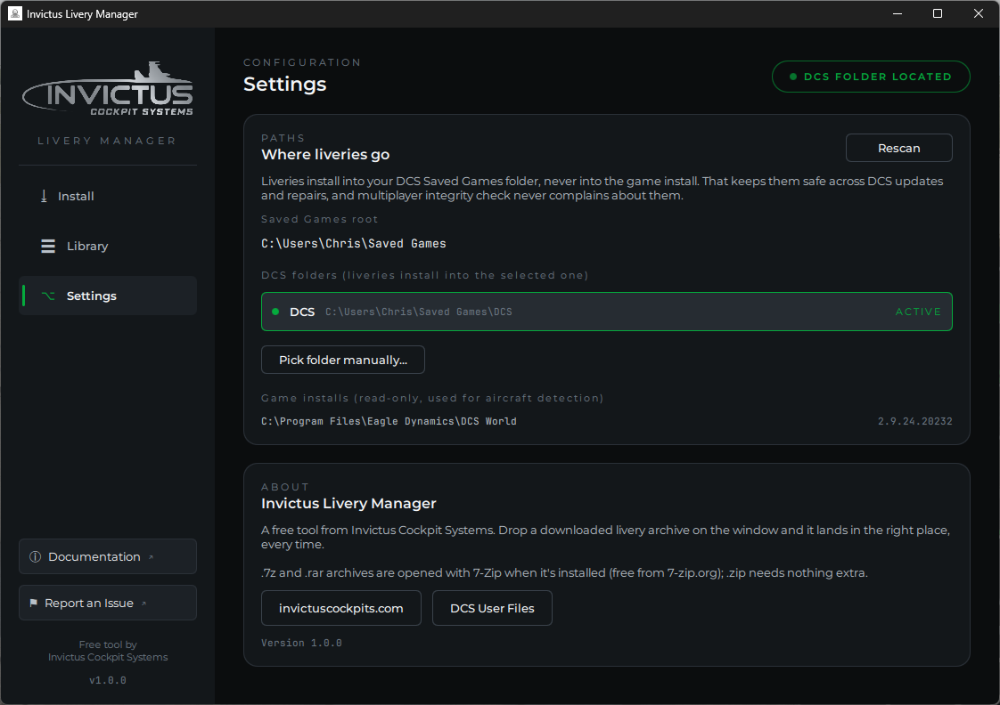

# Settings

## Where liveries go

The manager finds your DCS Saved Games folder automatically — including a
relocated Saved Games, and including machines that still have both a `DCS` and
a `DCS.openbeta` folder from before Eagle Dynamics merged the two branches.
Every folder found is listed; liveries install into the one marked **ACTIVE**.
Click another row to switch.

The pill in the top-right corner mirrors this state everywhere in the app:
green **DCS FOLDER LOCATED** when a folder is selected, yellow
**DCS NOT FOUND** when the scan came up empty. Clicking it brings you here.

## When DCS isn't found

Two common reasons:

1. **DCS has never been launched** on this PC. The game creates its Saved
   Games folder on first launch — run DCS once, then click **Rescan**.
2. **Your Saved Games folder lives somewhere unusual** (moved to another
   drive, portable setup). Click **Pick folder manually...** and select your
   DCS user folder — the one that contains `Config`, `Logs`, and (eventually)
   `Liveries`, usually called `DCS`. The manager remembers your choice;
   **Forget manual folder** undoes it.

## Game installs

Below the Saved Games section the manager lists any DCS **game installations**
it found (standalone or Steam), with the game version where available. These
are **read-only** — the manager never writes into the game install. They're
used to detect which aircraft modules you own, so the aircraft picker on the
Install page knows the correct livery folder name for every module — even one
released after this version of the manager.
