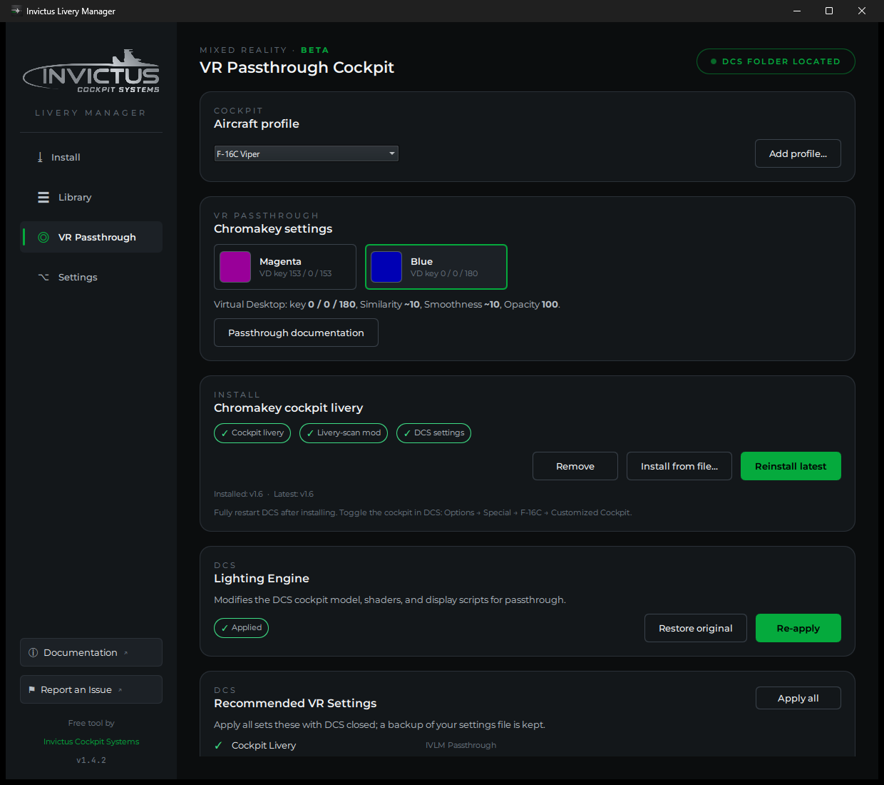
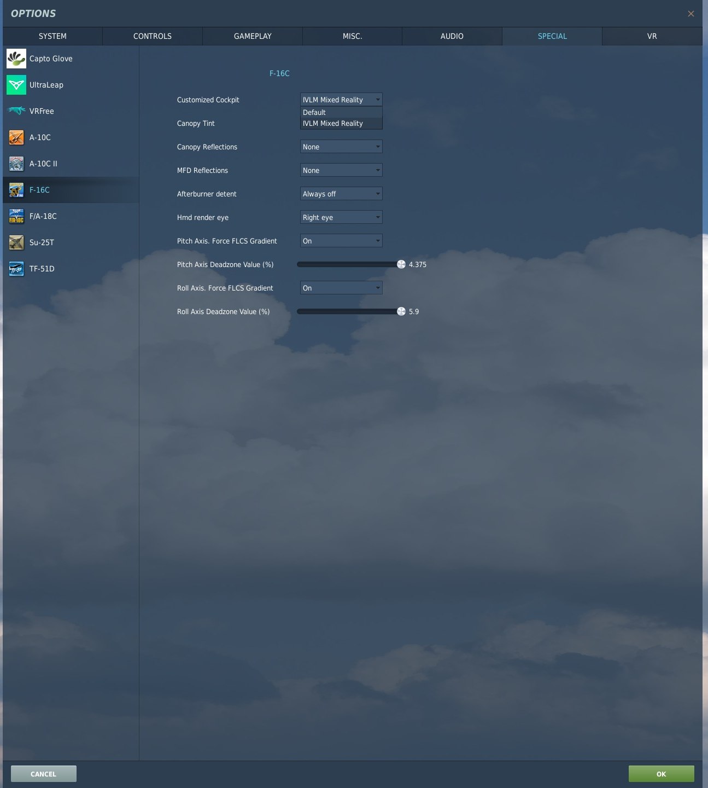

# VR Passthrough Cockpit

!!! warning "Beta"
    The VR Passthrough cockpit is a beta release. It works end to end, and
    we're refining it with tester feedback; report anything odd through
    **Report an Issue** in the app sidebar.

The VR Passthrough page sets up a mixed reality cockpit: you fly DCS in a
headset while seeing your real, physical cockpit through passthrough. The
manager installs a special cockpit livery that paints every physical surface
of the virtual cockpit in a chroma-key color. Virtual Desktop then replaces
that color with the camera feed, so everything below the canopy rails becomes
your real pit while the HUD, canopy, outside world, and airframe stay in the
headset. The passthrough boundary follows the jet's own 3D geometry as you
move your head.

## What you need

- A physical cockpit to sit in. The livery is built for 1:1 replica pits;
  every switch, gauge, and panel you see is the real one in front of you.
- A Quest 3 (or similar headset) running **Virtual Desktop** with
  passthrough chroma keying.
- The DCS F-16C or F/A-18C module. Both ship as built-in cockpit
  profiles; more are on the way, and you can wire in your own (see
  Cockpit profiles below).

## Install the cockpit livery

Pick your aircraft in the profile selector, then click **Install cockpit
livery**. The manager downloads the latest livery, installs it into your
DCS Saved Games folder, and adds a small livery-scan helper mod that DCS
needs before it will load cockpit liveries from Saved Games. Nothing is
written into the game installation for this step.

The livery installs under its own name, so your stock cockpit is untouched.
Switch between the passthrough cockpit and the normal one any time in DCS
under **Options → Special → F-16C → Customized Cockpit** (or the
matching F/A-18C entry for the Hornet). After installing
or switching, always close DCS completely and restart it; DCS only scans
for liveries at startup.

**Remove** uninstalls both the livery and the helper mod cleanly.

!!! note "About that dropdown"
    The Viper's cockpit-livery dropdown has been broken in DCS itself for
    years: the cockpit reads the selection from a different place than the
    options screen writes it. The manager works around this automatically
    when it applies your settings, which is also why the dropdown starts
    working once the manager has set things up.

## Recommended DCS settings

The chroma key works best with specific renderer settings. Reflections
paint moving highlights over the key color, shadows darken it, and lens
effects bloom across it; any of these can punch holes in the passthrough.
The page audits every recommended setting and shows what differs.

Click **Apply all** with DCS fully closed. The manager patches the settings
file directly and keeps a backup alongside it; **Restore backup** puts your
old settings back. DCS must be closed because it rewrites its settings file
on exit and would overwrite the changes.

The applied settings are: canopy and MFD reflections off (both the F-16C
special options and the global graphics toggle), shadows flat/off, SSAO off,
SSLR off, cockpit global illumination off, lens effects off, and motion blur
off. Everything else, including your resolution and VR settings, is left
alone.

## Lighting Engine

**Lighting Engine** fixes three things no livery can reach:

- **Key stability in flight.** DCS's cockpit lighting used to shade the
  chroma color with sun, shadow, and reflections, so surfaces "popped"
  pink as the aircraft maneuvered. The patch adds a shader bypass that
  outputs the key as a constant before lighting touches it (community
  fix by beta tester Ron D), and a final-pass snap that pins every
  key-hued pixel to the exact key color, so texture filtering,
  anti-aliasing, exposure, and lit indicator overlays can't push the
  key out of the chroma window either.

- **Magenta light bleed.** The keyed cockpit acts as a bright light
  source, and DCS's cockpit ambient lighting washes that color onto the
  virtual parts (canopy frame, HUD arms). The patch tames the cockpit's
  image-based lighting so the bleed disappears. Recommended for all
  passthrough flying.
- **Night flying.** At night, DCS's lighting leaves the cockpit too dark
  for the chroma key to work. With the patch applied, turn the
  instrument lighting knobs up after dark and the cockpit keys
  correctly. Day flying with the knobs off is unchanged.

This is the one feature that modifies files in the DCS installation (the
F-16C cockpit model, its lighting parameters, and the cockpit shader),
so applying it shows a Windows administrator prompt. The manager keeps
pristine backups of the original files, and **Restore original** puts
them back at any time.

!!! warning "One-time slow DCS start"
    Applying or restoring the patch clears DCS's compiled-shader
    caches, and the **next DCS launch rebuilds them: DCS can sit at a
    frozen-looking screen for 10 to 30 minutes**. This is normal,
    happens once, and must not be interrupted; do not end the DCS
    process. Every launch after that is normal speed.

Two things to know:

- **DCS updates and repairs quietly undo the patch.** Nothing breaks; the
  cockpit simply goes back to dark nights. Re-apply the patch from this page
  after updating.
- **Strict multiplayer servers** with pure-client integrity checks will flag
  the modified cockpit model. Use **Restore original** before flying on
  those servers, and re-apply afterward.

## Display exports

With the passthrough livery, the keyed display screens show your real
pit, but DCS would still draw the display symbology in the virtual
cockpit, so MFD pages, DED lines, and RWR contacts would float over
your physical screens. The Lighting Engine handles this automatically,
one display at a time, from your DCS monitor setup: a display with an
export viewport assigned leaves the virtual cockpit and renders only on
your physical screen; a display without one stays exactly where DCS
draws it. There is no switch to remember, and no display can end up
rendering nowhere.

The viewport names to use in your monitor setup are `LEFT_MFCD`,
`RIGHT_MFCD`, `EHSI`, `DED`, `RWR`, `CMDS`, and `UHF_RADIO` for the
F-16C. The MFD and EHSI names are the ones DCS already uses; the DED,
RWR, CMDS, and UHF hooks are added by the Lighting Engine, since DCS
doesn't ship export support for those displays. For the F/A-18C Hornet
the names are `LEFT_MFCD`, `RIGHT_MFCD`, `CENTER_MFCD`, `RWR`, `UFC`,
and `IFEI`; the first three are the names DCS already uses, and the
RWR, UFC, and IFEI hooks are added by the Lighting Engine.

**VR users with export screens** need two DCS-side settings. In the DCS
VR options, set the mirror to use the DCS system resolution; with the
default headset-sized mirror the DCS window shrinks to the mirror pane
while the headset is active, and any export viewport outside it, which
is where a physical MFD monitor usually sits, goes dark even though the
same layout works in 2D. The settings audit on this page flags it. Your
monitor setup file also needs the line `VR_allow_MFD_out_of_HMD = true`
at the top level; AIM Cockpit Manager writes it for you.

Changing your monitor setup takes effect on the next DCS start; the
Lighting Engine itself doesn't need re-applying for it.

## Choosing the key color

The Headset section of the VR Passthrough page offers two chroma key
colors, magenta and blue, with a sample square of each. The choice
applies to every aircraft. Switching recolors the installed cockpit
livery on the spot, and the Lighting Engine generates its
shaders for the same color, so re-apply the patch after switching
(that is one shader rebuild). Magenta is the proven default. Blue is
offered because it is less noticeable after Virtual Desktop's video
compression: any fringe the encoder leaves at the passthrough edge is
dark blue rather than bright pink.

## Virtual Desktop setup

On the headset, use Virtual Desktop with the **VDXR** runtime and
**HEVC 10-bit** at the highest bitrate your setup sustains. In the
passthrough settings, enable chroma keying with the values for the
key color you chose. The app shows the same values in a popup after
the Lighting Engine is applied.

| Setting | Magenta | Blue |
| --- | --- | --- |
| Key color (red, green, blue) | 153, 0, 153 | 0, 0, 120 |
| Similarity | about 17 percent | about 9 percent |
| Smoothness | about 12 percent | about 9 percent |
| Opacity | 100 percent | 100 percent |

The magenta values assume the Lighting Engine is applied: it
outputs a dimmed key that reduces the pink edge fringe, and the old
255/0/255 key no longer matches. The blue values are a separate
setup; do not carry either key's Similarity and Smoothness over to the
other. Tune Similarity and Smoothness a point or two to
your lighting.

Turn off Virtual Desktop's video sharpening; it amplifies color fringing at
the passthrough edges. For night flying, apply the Lighting Engine and
raise Similarity a few points if dim corners of the pit stop keying.

## Aligning the virtual and physical cockpit

The passthrough boundary follows DCS's cockpit geometry, so the
virtual cockpit needs to sit exactly where your physical one does:
same position, same size. Both adjustments live in DCS; Virtual
Desktop has nothing to align because the camera feed is locked to the
real world by the headset's own tracking.

**Match the size first.** In DCS's VR settings tab, enable the forced
IPD distance and treat it as a world-scale dial: a smaller value makes
the virtual cockpit larger, a larger value makes it smaller. Your
glareshield is the ideal ruler; adjust until the virtual glareshield
width matches the physical one. This scales the whole world uniformly,
and at the small corrections a cockpit match needs, the effect outside
the canopy is barely noticeable.

**Then set the position.** Sit in your normal flying posture and
recenter VR (Num 5 by default). Nudge the cockpit camera until virtual
landmarks line up with their physical counterparts: the cockpit camera
move controls are bound under the View Cockpit category (RCtrl+RShift
plus the numpad keys by default), and RCtrl+RShift+Num 5 resets the
camera if you get lost. When the glareshield edges and canopy rails
line up, press **RAlt+Num 0** (Save Cockpit Angles) to store it as the
aircraft's default view. From then on, every VR recenter snaps the
virtual pit back into alignment with the real one.

Two supporting details: set your headset's floor height honestly,
since it anchors the vertical origin DCS receives, and expect to
iterate the size and position steps once or twice, since scaling
shifts the landmarks you aligned to.

## Cockpit profiles

The profile selector at the top of the page chooses which aircraft
everything on the page operates on. Profiles that ship with the manager
(the F-16C today) carry everything built in: the right folders, the right
settings, the loader workaround, and the night patch where one exists.

**Add profile...** wires in an aircraft the manager doesn't ship a profile
for yet. You'll need the cockpit unit folder name (the folder DCS uses
under `Liveries`, for example `Cockpit_F-18C`; the folder button lets you
pick it from your game installation instead of typing it) and the options
section name the aircraft uses in DCS's settings file. The loader section
and release tag are optional and only needed for special cases. Custom
profiles install liveries from local zip files, and **Remove** deletes
them again; built-in profiles can't be removed.

## Updates

Invictus cockpit liveries carry a version stamp. The page compares your
installed version against the latest release and shows both under the
install button; when a newer livery is available the button changes to
**Update to v...**. Livery updates are independent of app updates, so
improvements ship as soon as they're ready.

## Troubleshooting

- **The cockpit isn't magenta in DCS.** Restart DCS completely; liveries
  only load at startup. Then check all three status pills on the page are
  green and that **Options → Special → F-16C → Customized Cockpit** shows
  the passthrough livery.
- **Glare or reflections punch holes in the passthrough.** Run **Apply
  all** under Recommended DCS settings with DCS closed. If you changed
  graphics settings recently, re-run it; DCS sometimes reintroduces
  reflections.
- **The cockpit is green or dark at night, or virtual parts have a pink
  tint.** Apply the Lighting Engine, then turn the instrument
  lighting knobs up at night. If either symptom returns after a DCS
  update, re-apply the patch.
- **Display symbology floats over your physical screens.** Turn on
  **display exports**. If it's already on and a display came back after a
  DCS update, the update restored the stock scripts; re-apply it.
- **A multiplayer server rejects you.** Use **Restore original** in the
  cockpit lighting section and **Turn off** under display exports, fly,
  then re-apply both afterward.
- **Thin dark trim markings on some panel edges** are a known cosmetic
  residual of the current livery and are purely visual.
- **A thin pink fringe at the passthrough boundary** comes from the
  headset video stream's color compression, not from DCS: video codecs
  store color at reduced resolution, smearing the key slightly across
  edges. HEVC 10-bit (or AV1 10-bit), the highest bitrate your link
  sustains, and the VDXR runtime keep it minimal. A dedicated
  treatment is planned.
